# Siren

# Examples 

## Flowchart

Python currently not running due to:
https://github.com/fable-compiler/Fable/issues/3808

<!--Example1-->
```fsharp
diagram.flowchart(flowchartDirection.bt, [
    flowchart.subgraph ("space", [
        flowchart.directionBT
        flowchart.linkDottedArrow("earth", "moon", formatting.unicode "🚀", 6)
        flowchart.nodeRound "moon"
        flowchart.subgraph ("atmosphere", [
            flowchart.nodeCircle "earth"
        ])
    ])
])
|> siren.write

```


<!--Example1-End-->

```mermaid
flowchart BT
    subgraph space
        direction BT
        earth-......->|"🚀"|moon
        moon(moon)
        subgraph atmosphere
            earth((earth))
        end
    end

```

## Class Diagram

<!--Example2-->
```fsharp
let duck,animal,zebra,fish = "Duck","Animal","Zebra", "Fish"
siren.classDiagram [
    classDiagram.note "From Duck till Zebra"
    classDiagram.relationshipInheritance(duck, animal)
    classDiagram.note(@"can fly\ncan swim\ncan dive\ncan help in debugging", duck)
    classDiagram.relationshipInheritance(fish, animal)
    classDiagram.relationshipInheritance(zebra, animal)
    classDiagram.classMember(animal,"+int age")
    classDiagram.classMember(animal,"+String gender")
    classDiagram.classMember(animal,"+isMammal()")
    classDiagram.classMember(animal,"+mate()")
    classDiagram.class'(duck,members=[
        "+String beakColor"
        "+swim()"
        "+quack()"
    ])
    classDiagram.class'(fish,members=[
        "-int sizeInFeet"
        "-canEat()"
    ])
    classDiagram.class'(zebra,members=[
        "+bool is_wild"
        "+run()"
    ])
    classDiagram.namespace'("Mammals", [
        classDiagram.class'(zebra)
    ])
]
|> siren.write

```


<!--Example2-End-->

## Entity Relationship Diagram

<!--Example3-->
```fsharp
let CAR, NAMED_DRIVER, PERSON, MANUFACTURER = "CAR", "NAMED-DRIVER", "PERSON", "MANUFACTURER"
siren.erDiagram [
    erDiagram.relationship (CAR, erCardinality.onlyOne, NAMED_DRIVER, erCardinality.zeroOrMany, "allows")
    erDiagram.entity (CAR,attr=[
        erDiagram.attribute("string", "registrationNumber", [erKey.pk])
        erDiagram.attribute("string", "make")
        erDiagram.attribute("string", "model")
        erDiagram.attribute("string[]", "parts")
    ])
    erDiagram.relationship (PERSON, erCardinality.onlyOne, NAMED_DRIVER, erCardinality.zeroOrMany, "is")
    erDiagram.entity (PERSON,attr=[
        erDiagram.attribute("string", "driversLicense", [erKey.pk], "The license is #")
        erDiagram.attribute("string(99)", "firstName", comment="Only 99 characters are allowed")
        erDiagram.attribute("string", "lastName")
        erDiagram.attribute("string", "phone", [erKey.uk])
        erDiagram.attribute("int", "age")
    ])
    erDiagram.entity(NAMED_DRIVER, attr=[
        erDiagram.attribute("string", "carRegistrationNumber", [erKey.pk; erKey.fk])
        erDiagram.attribute("string", "driverLicence", [erKey.pk; erKey.fk])
    ])
    erDiagram.relationship(MANUFACTURER,erCardinality.onlyOne,CAR,erCardinality.zeroOrMany,"makes")
]
|> siren.write

```


<!--Example3-End-->
