# Siren

# Examples 

## Flowchart

Python currently not running due to:
https://github.com/fable-compiler/Fable/issues/3808

<!--Example1-->
```fsharp
diagram.flowchart(flowchartDirection.bt, [
    flowchart.subgraph ("space", [
        flowchart.directionBT
        flowchart.linkDottedArrow("earth", "moon", formatting.unicode "🚀", 6)
        flowchart.nodeRound "moon"
        flowchart.subgraph ("atmosphere", [
            flowchart.nodeCircle "earth"
        ])
    ])
])
|> siren.write

```

```mermaid
flowchart BT
    subgraph space
        direction BT
        earth-......->|"🚀"|moon
        moon(moon)
        subgraph atmosphere
            earth((earth))
        end
    end

```


<!--Example1-End-->