# Siren

# Examples 

## Flowchart

<!--Example1-->
```fsharp
diagram.flowchart.bt [
    subgraph.subgraph "space" [
        direction.bt
        link.dottedArrow(node.simple "earth", node.simple "moon", formatting.unicode "🚀", 6)
        node.round "moon" "moon"
        subgraph.subgraph "atmosphere" [
            node.circle "earth" "earth"
        ]
    ]
]
|> siren.write

```

```mermaid
flowchart BT
    subgraph space
        direction BT
        earth-......->|"🚀"|moon
        moon(moon)
        subgraph atmosphere
            earth((earth))
        end
    end

```


<!--Example1-End-->