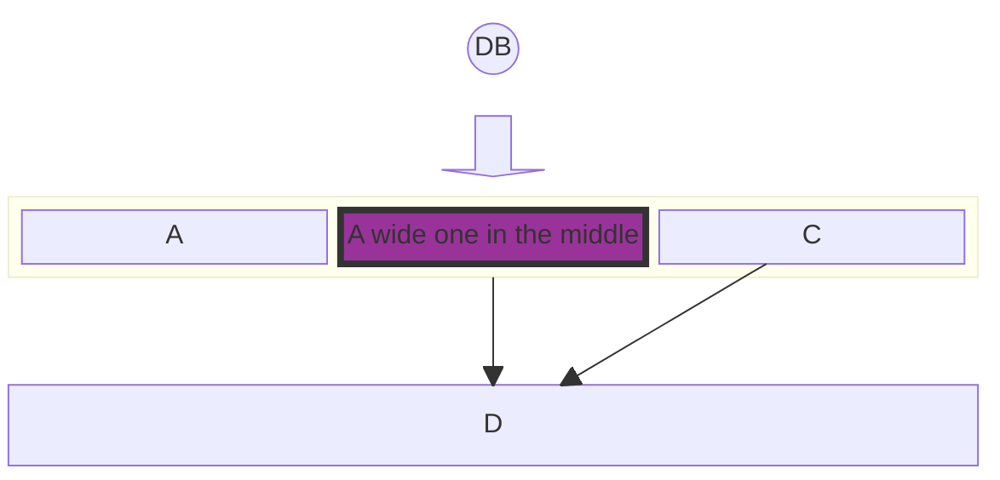
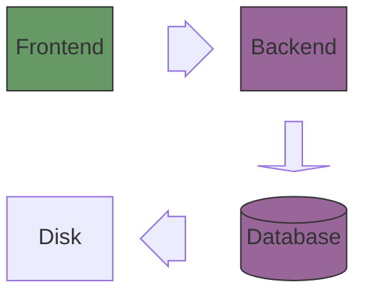
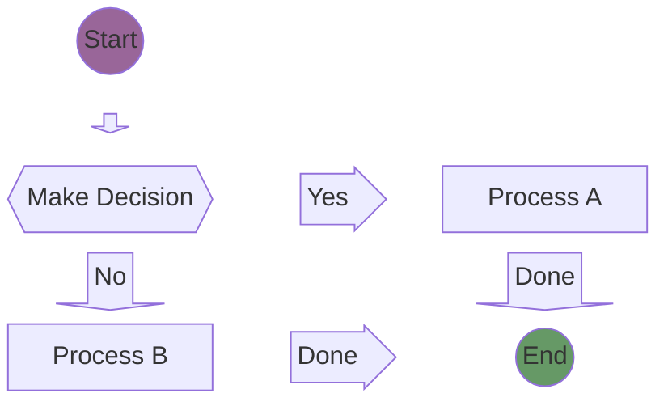

import Tabs from '@theme/Tabs';
import TabItem from '@theme/TabItem';

## Introduction

<Tabs groupId="preferred-lang" queryString>
<TabItem value="fsharp" label="F#">

```fsharp
siren.block [
    block.columns(1)
    block.blockCircle("db", "DB")
    block.arrowDown "blockArrowId6"
    block.cIdBlock("ID", [
        block.block("A")
        block.block("B", "A wide one in the middle")
        block.block("C")
    ])
    block.space
    block.block("D")
    block.link ("ID", "D")
    block.link ("C", "D")
    block.style ("B", ["fill", "#939"; "stroke", "#333"; "stroke-width", "4px"])
]
|> siren.write
```

</TabItem>
<TabItem value="csharp" label="C#">

```csharp
siren.block([
    Block.columns(1),
    Block.blockCircle("db", "DB"),
    Block.arrowDown("blockArrowId6"),
    Block.cIdBlock("ID", [
        Block.block("A"),
        Block.block("B", "A wide one in the middle"),
        Block.block("C")
    ]),
    Block.space,
    Block.block("D"),
    Block.link("ID", "D"),
    Block.link("C", "D"),
    Block.style("B", [
        ("fill", "#939"),
        ("stroke", "#333"),
        ("stroke-width", "4px")
    ])
]).write();
```

</TabItem>
<TabItem value="py" label="Python">

```py
siren.block([
    block.columns(1),
    block.block_circle("db", "DB"),
    block.arrow_down("blockArrowId6"),
    block.c_id_block("ID", [
        block.block("A"),
        block.block("B", "A wide one in the middle"),
        block.block("C")
    ]),
    block.space(),
    block.block("D"),
    block.link("ID", "D"),
    block.link("C", "D"),
    block.style("B", [
        ("fill", "#939"),
        ("stroke", "#333"),
        ("stroke-width", "4px")
    ])
]).write()
```

</TabItem>
<TabItem value="js" label="JavaScript">

```js
siren.block([
    block.columns(1),
    block.blockCircle("db", "DB"),
    block.arrowDown("blockArrowId6"),
    block.cIdBlock("ID", [
        block.block("A"),
        block.block("B", "A wide one in the middle"),
        block.block("C")
    ]),
    block.space,
    block.block("D"),
    block.link("ID", "D"),
    block.link("C", "D"),
    block.style("B", [
        ["fill", "#939"],
        ["stroke", "#333"],
        ["stroke-width", "4px"]
    ])
]).write();
```

</TabItem>
</Tabs>

{/* output */}

<Tabs>
<TabItem value="graph" label="Graph">

</TabItem>
<TabItem value="output" label="Output">
```yml
block-beta
    columns 1
    db(("DB"))
    blockArrowId6<["&nbsp;&nbsp;&nbsp;"]>(down)
    block:ID
        A["A"]
        B["A wide one in the middle"]
        C["C"]
    end
    space
    D["D"]
    ID-->D
    C-->D
    style B fill:#939,stroke:#333,stroke-width:4px;
```
</TabItem>
</Tabs>

## Services

<Tabs groupId="preferred-lang" queryString>
<TabItem value="fsharp" label="F#">

```fsharp
let Frontend, Backend, Database = "Frontend", "Backend", "Database"
let actual = 
    siren.block [
        block.columns(3)
        block.line [
            block.block(Frontend)
            block.arrowRight("blockArrowId6",1)
            block.block(Backend)
        ]
        block.line [
            block.spacew 2
            block.arrowDown("down",1)
        ]
        block.line [
            block.block "Disk"
            block.arrowLeft("left",1)
            block.blockCylindrical(Database)
        ]
        block.classDef("front", ["fill", "#696"; "stroke", "#333"])
        block.classDef("back", ["fill", "#969"; "stroke", "#333"])
        block.``class``([Frontend], "front")
        block.``class``([Backend; Database], "back")
    ]
    |> siren.write
```

</TabItem>
<TabItem value="csharp" label="C#">

```csharp
(string Frontend, string Backend, string Database) = ("Frontend", "Backend", "Database");
string actual =
    siren.block([
        Block.columns(3),
        Block.line([
            Block.block(Frontend),
            Block.arrowRight("blockArrowId6", 1),
            Block.block(Backend)
        ]),
        Block.line([
            Block.spacew(2),
            Block.arrowDown("down", 1)
        ]),
        Block.line([
            Block.block("Disk"),
            Block.arrowLeft("left", 1),
            Block.blockCylindrical(Database)
        ]),
        Block.classDef("front", [
            ("fill", "#696"), 
            ("stroke", "#333")
        ]),
        Block.classDef("back", [("fill", "#969"), ("stroke", "#333")]),
        Block.@class([Frontend], "front"),
        Block.@class([Backend, Database], "back")
    ]).write();
```

</TabItem>
<TabItem value="py" label="Python">

```py
Frontend, Backend, Database = "Frontend", "Backend", "Database"
actual = (
  siren.block([
    block.columns(3),
    block.line([
        block.block(Frontend),
        block.arrow_right("blockArrowId6", 1),
        block.block(Backend)
    ]),
    block.line([
        block.spacew(2),
        block.arrow_down("down", 1)
    ]),
    block.line([
        block.block("Disk"),
        block.arrow_left("left", 1),
        block.block_cylindrical(Database)
    ]),
    block.class_def("front", [
        ("fill", "#696"), 
        ("stroke", "#333")
    ]),
    block.class_def("back", [("fill", "#969"), ("stroke", "#333")]),
    block.class_([Frontend], "front"),
    block.class_([Backend, Database], "back")
  ]).write()
)
```

</TabItem>
<TabItem value="js" label="JavaScript">

```js
const [Frontend, Backend, Database] = ["Frontend", "Backend", "Database"];
const actual = 
    siren.block([
        block.columns(3),
        block.line([
          block.block(Frontend),
          block.arrowRight("blockArrowId6", 1),
          block.block(Backend)
        ]),
        block.line([
          block.spacew(2),
          block.arrowDown("down", 1)
        ]),
        block.line([
          block.block("Disk"),
          block.arrowLeft("left", 1),
          block.blockCylindrical(Database)
        ]),
        block.classDef("front", [
          ["fill", "#696"], 
          ["stroke", "#333"]
        ]),
        block.classDef("back", [
          ["fill", "#969"], 
          ["stroke", "#333"]
        ]),
        block.class([Frontend], "front"),
        block.class([Backend, Database], "back")
    ]).write();
```

</TabItem>
</Tabs>

{/* output */}

<Tabs>
<TabItem value="graph" label="Graph">

</TabItem>
<TabItem value="output" label="Output">
```yml
block-beta
    columns 3
    Frontend["Frontend"] blockArrowId6<["&nbsp;"]>(right) Backend["Backend"]
    space:2 down<["&nbsp;"]>(down)
    Disk["Disk"] left<["&nbsp;"]>(left) Database[("Database")]
    classDef front fill:#696,stroke:#333;
    classDef back fill:#969,stroke:#333;
    class Frontend front
    class Backend,Database back
```
</TabItem>
</Tabs>

## Decision Making

<Tabs groupId="preferred-lang" queryString>
<TabItem value="fsharp" label="F#">

```fsharp
siren.block [
    block.columns(3)
    block.line [
        block.blockCircle("Start")
        block.spacew(2)
    ]
    block.line [
        block.arrowDownLabeled("down", " ")
        block.spacew(2)
    ]
    block.line [
        block.blockHexagon("Decision","Make Decision")
        block.arrowRightLabeled("right", "Yes")
        block.block("Process1", "Process A")
    ]
    block.line [
        block.arrowDownLabeled("downAgain", "No")
        block.space
        block.arrowDownLabeled("r3", "Done")
    ]
    block.line [
        block.block("Process2", "Process B")
        block.arrowRightLabeled ("r2", "Done")
        block.blockCircle("End")
    ]
    block.style("Start", ["fill", "#969"])
    block.style("End", ["fill", "#696"])
]
|> siren.write
```

</TabItem>
<TabItem value="csharp" label="C#">

```csharp
siren.block([
    Block.columns(3),
    Block.line([
        Block.blockCircle("Start"),
        Block.spacew(2)
    ]),
    Block.line([
        Block.arrowDownLabeled("down", " "),
        Block.spacew(2)
    ]),
    Block.line([
        Block.blockHexagon("Decision", "Make Decision"),
        Block.arrowRightLabeled("right", "Yes"),
        Block.block("Process1", "Process A")
    ]),
    Block.line([
        Block.arrowDownLabeled("downAgain", "No"),
        Block.space,
        Block.arrowDownLabeled("r3", "Done")
    ]),
    Block.line([
        Block.block("Process2", "Process B"),
        Block.arrowRightLabeled("r2", "Done"),
        Block.blockCircle("End")
    ]),
    Block.style("Start", [("fill", "#969")]),
    Block.style("End", [("fill", "#696")])
]).write();
```

</TabItem>
<TabItem value="py" label="Python">

```py
siren.block([
    block.columns(3),
    block.line([
        block.block_circle("Start"),
        block.spacew(2)
    ]),
    block.line([
        block.arrow_down_labeled("down", " "),
        block.spacew(2)
    ]),
    block.line([
        block.block_hexagon("Decision", "Make Decision"),
        block.arrow_right_labeled("right", "Yes"),
        block.block("Process1", "Process A")
    ]),
    block.line([
        block.arrow_down_labeled("downAgain", "No"),
        block.space(),
        block.arrow_down_labeled("r3", "Done")
    ]),
    block.line([
        block.block("Process2", "Process B"),
        block.arrow_right_labeled("r2", "Done"),
        block.block_circle("End")
    ]),
    block.style("Start", [("fill", "#969")]),
    block.style("End", [("fill", "#696")])
]).write()
```

</TabItem>
<TabItem value="js" label="JavaScript">

```js
siren.block([
  block.columns(3),
  block.line([
    block.blockCircle("Start"),
    block.spacew(2)
  ]),
  block.line([
    block.arrowDownLabeled("down", " "),
    block.spacew(2)
  ]),
  block.line([
    block.blockHexagon("Decision", "Make Decision"),
    block.arrowRightLabeled("right", "Yes"),
    block.block("Process1", "Process A")
  ]),
  block.line([
    block.arrowDownLabeled("downAgain", "No"),
    block.space,
    block.arrowDownLabeled("r3", "Done")
  ]),
  block.line([
    block.block("Process2", "Process B"),
    block.arrowRightLabeled("r2", "Done"),
    block.blockCircle("End")
  ]),
  block.style("Start", [["fill", "#969"]]),
  block.style("End", [["fill", "#696"]])
]).write();
```

</TabItem>
</Tabs>

{/* output */}

<Tabs>
<TabItem value="graph" label="Graph">

</TabItem>
<TabItem value="output" label="Output">
```yml
block-beta
    columns 3
    Start(("Start")) space:2
    down<[" "]>(down) space:2
    Decision{{"Make Decision"}} right<["Yes"]>(right) Process1["Process A"]
    downAgain<["No"]>(down) space r3<["Done"]>(down)
    Process2["Process B"] r2<["Done"]>(right) End(("End"))
    style Start fill:#969;
    style End fill:#696;
```
</TabItem>
</Tabs>