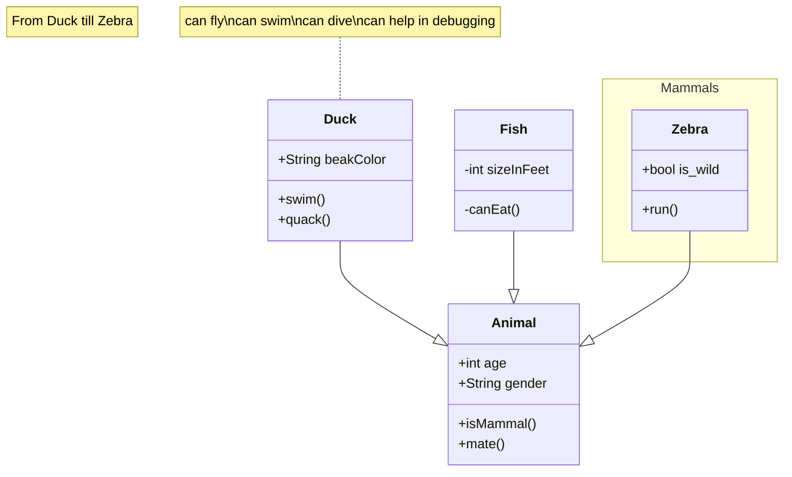
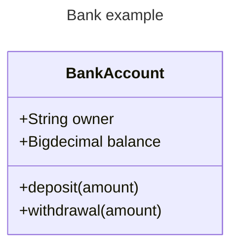
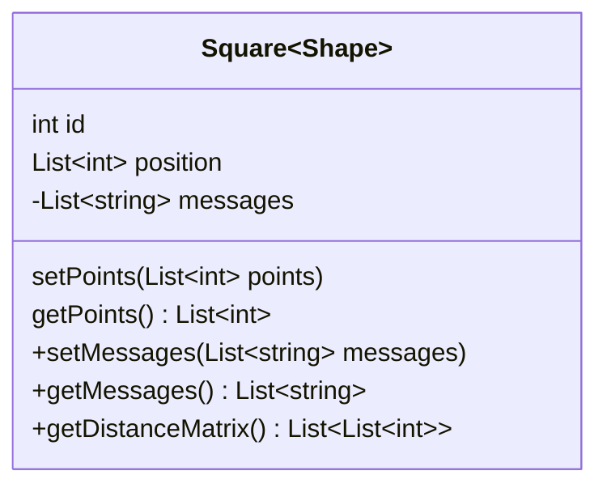
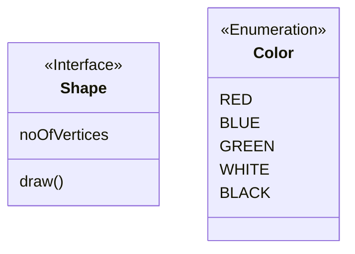
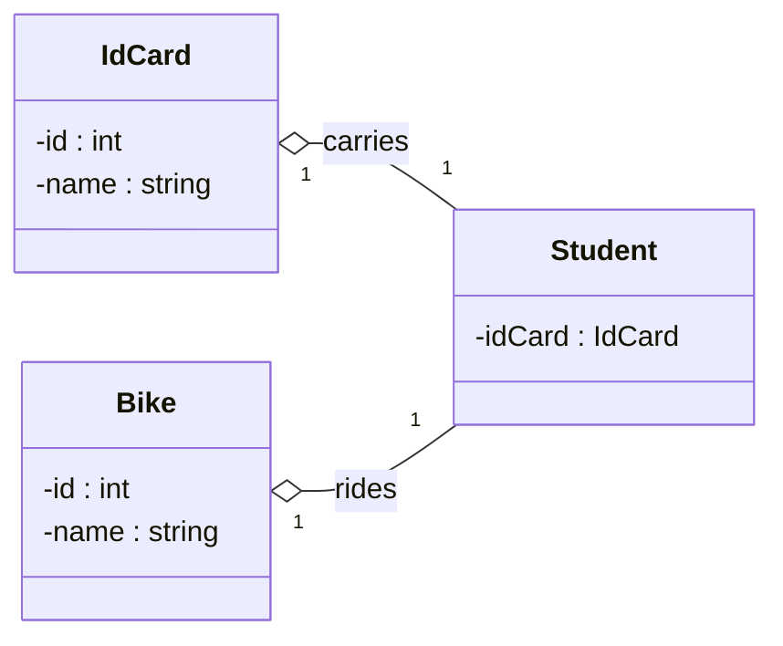

import Tabs from '@theme/Tabs';
import TabItem from '@theme/TabItem';

## Animals

<Tabs groupId="preferred-lang" queryString>
<TabItem value="fsharp" label="F#">

```fsharp
let duck,animal,zebra,fish = "Duck","Animal","Zebra","Fish"
siren.classDiagram [
    classDiagram.note "From Duck till Zebra"
    classDiagram.relationshipInheritance(duck, animal)
    classDiagram.note(@"can fly\ncan swim\ncan dive\ncan help in debugging", duck)
    classDiagram.relationshipInheritance(fish, animal)
    classDiagram.relationshipInheritance(zebra, animal)
    classDiagram.idAttr(animal,"age", "int", classMemberVisibility.Public)
    classDiagram.idAttr(animal, "gender", "String", classMemberVisibility.Public)
    classDiagram.idFunction(animal, "isMammal", classMemberVisibility = classMemberVisibility.Public)
    classDiagram.idFunction(animal, "mate", classMemberVisibility = classMemberVisibility.Public)
    classDiagram.``class``(duck,members=[
        classDiagram.classAttr("beakColor","String", classMemberVisibility.Public)
        classDiagram.classFunction("swim", classMemberVisibility = classMemberVisibility.Public)
        classDiagram.classFunction("quack", classMemberVisibility = classMemberVisibility.Public)
    ])
    classDiagram.``class``(fish,members=[
        classDiagram.classAttr("sizeInFeet","int", classMemberVisibility.Private)
        classDiagram.classFunction("canEat", classMemberVisibility = classMemberVisibility.Private)
    ])
    classDiagram.``class``(zebra,members=[
        classDiagram.classAttr("is_wild","bool", classMemberVisibility.Public)
        classDiagram.classFunction("run", classMemberVisibility = classMemberVisibility.Public)
    ])
    classDiagram.``namespace``("Mammals", [
        classDiagram.classId(zebra)
    ])
]
|> siren.write
```

</TabItem>
<TabItem value="csharp" label="C#">

```csharp
(string duck, string fish, string zebra, string animal) = ("Duck", "Fish", "Zebra", "Animal");
string actual = siren.classDiagram
    ([
        classDiagram.note("From Duck till Zebra"),
        classDiagram.relationshipInheritance(duck, animal),
        classDiagram.note(@"can fly\ncan swim\ncan dive\ncan help in debugging", duck),
        classDiagram.relationshipInheritance(fish, animal),
        classDiagram.relationshipInheritance(zebra, animal),
        classDiagram.idAttr(animal,"age", "int", classMemberVisibility.@public),
        classDiagram.idAttr(animal, "gender", "String", classMemberVisibility.@public),
        classDiagram.idFunction(animal, "isMammal", classMemberVisibility: classMemberVisibility.@public),
        classDiagram.idFunction(animal, "mate", classMemberVisibility: classMemberVisibility.@public),
        classDiagram.@class(duck, [
            classDiagram.classAttr("beakColor", "String", classMemberVisibility.@public),
            classDiagram.classFunction("swim", classMemberVisibility: classMemberVisibility.@public),
            classDiagram.classFunction("quack", classMemberVisibility: classMemberVisibility.@public)
        ]),
        classDiagram.@class(fish, [
            classDiagram.classAttr("sizeInFeet", "int", classMemberVisibility.@private),
            classDiagram.classFunction("canEat", classMemberVisibility: classMemberVisibility.@private)
        ]),
        classDiagram.@class(zebra, members: [
            classDiagram.classAttr("is_wild", "bool", classMemberVisibility.@public),
            classDiagram.classFunction("run", classMemberVisibility: classMemberVisibility.@public)
        ]),
        classDiagram.@namespace("Mammals", [
            classDiagram.classId(zebra)
        ])
    ]).write();
```

</TabItem>
<TabItem value="py" label="Python">

```py
(duck,animal,zebra,fish) = ("Duck","Animal","Zebra","Fish")
siren.class_diagram([
    class_diagram.note("From Duck till Zebra"),
    class_diagram.relationship_inheritance(duck, animal),
    class_diagram.note("can fly\ncan swim\ncan dive\ncan help in debugging", duck),
    class_diagram.relationship_inheritance(fish, animal),
    class_diagram.relationship_inheritance(zebra, animal),
    class_diagram.id_attr(animal, "age", "int", class_member_visibility.Public()),
    class_diagram.id_attr(animal, "gender", "String", class_member_visibility.Public()),
    class_diagram.id_function(animal, "isMammal", class_member_visibility = class_member_visibility.Public()),
    class_diagram.id_function(animal, "mate", class_member_visibility = class_member_visibility.Public()),
    class_diagram.class_(duck, [
        class_diagram.class_attr("beakColor", "String", class_member_visibility.Public()),
        class_diagram.class_function("swim", class_member_visibility = class_member_visibility.Public()),
        class_diagram.class_function("quack", class_member_visibility = class_member_visibility.Public())
    ]),
    class_diagram.class_(fish, [
        class_diagram.class_attr("sizeInFeet","int", class_member_visibility.Private()),
        class_diagram.class_function("canEat", class_member_visibility = class_member_visibility.Private())
    ]),
    class_diagram.class_(zebra, [
        class_diagram.class_attr("is_wild","bool", class_member_visibility.Public()),
        class_diagram.class_function("run", class_member_visibility = class_member_visibility.Public())
    ]),
    class_diagram.namespace("Mammals", [
        class_diagram.class_id(zebra)
    ])
]).write()
```

</TabItem>
<TabItem value="js" label="JavaScript">

```js
let [duck,animal,zebra,fish] = ["Duck","Animal","Zebra","Fish"]
siren.classDiagram([
    classDiagram.note("From Duck till Zebra"),
    classDiagram.relationshipInheritance(duck, animal),
    classDiagram.note("can fly\ncan swim\ncan dive\ncan help in debugging", duck),
    classDiagram.relationshipInheritance(fish, animal),
    classDiagram.relationshipInheritance(zebra, animal),
    classDiagram.idAttr(animal, "age", "int", classMemberVisibility.Public),
    classDiagram.idAttr(animal, "gender", "String", classMemberVisibility.Public),
    classDiagram.idFunction(animal, "isMammal", null, null, classMemberVisibility.Public),
    classDiagram.idFunction(animal, "mate", null, null, classMemberVisibility.Public),
    classDiagram.class(duck, [
        classDiagram.classAttr("beakColor", "String", classMemberVisibility.Public),
        classDiagram.classFunction("swim", null, null, classMemberVisibility.Public),
        classDiagram.classFunction("quack", null, null, classMemberVisibility.Public)
    ]),
    classDiagram.class(fish, [
        classDiagram.classAttr("sizeInFeet","int", classMemberVisibility.Private),
        classDiagram.classFunction("canEat", null, null, classMemberVisibility.Private)
    ]),
    classDiagram.class(zebra, [
        classDiagram.classAttr("is_wild","bool", classMemberVisibility.Public),
        classDiagram.classFunction("run", null, null, classMemberVisibility.Public)
    ]),
    classDiagram.namespace("Mammals", [
        classDiagram.classId(zebra)
    ])
]).write();
```

</TabItem>
</Tabs>

{/* output */}

<Tabs>
<TabItem value="graph" label="Graph">

</TabItem>
<TabItem value="output" label="Output">
```yml
classDiagram
    note "From Duck till Zebra"
    Duck --|> Animal
    note for Duck "can fly\ncan swim\ncan dive\ncan help in debugging"
    Fish --|> Animal
    Zebra --|> Animal
    Animal : +int age
    Animal : +String gender
    Animal : +isMammal()
    Animal : +mate()
    class Duck{
        +String beakColor
        +swim()
        +quack()
    }
    class Fish{
        -int sizeInFeet
        -canEat()
    }
    class Zebra{
        +bool is_wild
        +run()
    }
    namespace Mammals {
        class Zebra
    }
```
</TabItem>
</Tabs>

## Class

<Tabs groupId="preferred-lang" queryString>
<TabItem value="fsharp" label="F#">

```fsharp
let bankacc = "BankAccount"
siren.classDiagram [
    classDiagram.classId(bankacc)
    classDiagram.idAttr(bankacc,"owner", "String", classMemberVisibility.Public)
    classDiagram.idAttr(bankacc,"balance", "Bigdecimal", classMemberVisibility.Public)
    classDiagram.idFunction(bankacc,"deposit", "amount", classMemberVisibility = classMemberVisibility.Public)
    classDiagram.idFunction(bankacc,"withdrawal", "amount", classMemberVisibility = classMemberVisibility.Public)
]
|> siren.withTitle ("Bank example")
|> siren.write
```

</TabItem>
<TabItem value="csharp" label="C#">

```csharp
string bankacc = "BankAccount";
string actual = siren.classDiagram
    ([
        classDiagram.classId(bankacc),
        classDiagram.idAttr(bankacc, "owner", "String", classMemberVisibility.@public),
        classDiagram.idAttr(bankacc, "balance", "Bigdecimal", classMemberVisibility.@public),
        classDiagram.idFunction(bankacc, "deposit", "amount", classMemberVisibility: classMemberVisibility.@public),
        classDiagram.idFunction(bankacc, "withdrawal", "amount", classMemberVisibility: classMemberVisibility.@public)
    ])
        .withTitle("Bank example")
        .write();
```

</TabItem>
<TabItem value="py" label="Python">

```py
bankacc = "BankAccount"
siren.class_diagram([
    class_diagram.class_id(bankacc),
    class_diagram.id_attr(bankacc,"owner", "String", class_member_visibility.Public()),
    class_diagram.id_attr(bankacc,"balance", "Bigdecimal", class_member_visibility.Public()),
    class_diagram.id_function(bankacc,"deposit", "amount", class_member_visibility = class_member_visibility.Public()),
    class_diagram.id_function(bankacc,"withdrawal", "amount", class_member_visibility = class_member_visibility.Public())
]).with_title("Bank example").write()
```

</TabItem>
<TabItem value="js" label="JavaScript">

```js
let bankacc = "BankAccount"
siren.classDiagram([
    classDiagram.classId(bankacc),
    classDiagram.idAttr(bankacc,"owner", "String", classMemberVisibility.Public),
    classDiagram.idAttr(bankacc,"balance", "Bigdecimal", classMemberVisibility.Public),
    classDiagram.idFunction(bankacc,"deposit", "amount", null, classMemberVisibility.Public),
    classDiagram.idFunction(bankacc,"withdrawal", "amount", null, classMemberVisibility.Public)
])
  .withTitle("Bank example")
  .write();
```

</TabItem>
</Tabs>

{/* output */}

<Tabs>
<TabItem value="graph" label="Graph">

</TabItem>
<TabItem value="output" label="Output">
```yml
---
title: Bank example
---
classDiagram
    class BankAccount
    BankAccount : +String owner
    BankAccount : +Bigdecimal balance
    BankAccount : +deposit(amount)
    BankAccount : +withdrawal(amount)
```
</TabItem>
</Tabs>

## Generic Types

<Tabs groupId="preferred-lang" queryString>
<TabItem value="fsharp" label="F#">

```fsharp
let square = "Square"
siren.classDiagram [
    classDiagram.classId(square, generic="Shape", members=[
        classDiagram.classAttr("id", "int")
        classDiagram.classAttr("position", "List<int>")
        classDiagram.classFunction("setPoints", "List<int> points")
        classDiagram.classFunction("getPoints", returnType = "List<int>")
    ])
    classDiagram.idAttr(square, "messages", "List<string>", classMemberVisibility.Private)
    classDiagram.idFunction(square, "setMessages", "List<string> messages", classMemberVisibility = classMemberVisibility.Public)
    classDiagram.idFunction(square, "getMessages", returnType = "List<string>", classMemberVisibility = classMemberVisibility.Public)
    classDiagram.idFunction(square, "getDistanceMatrix", returnType = "List<List<int>>", classMemberVisibility = classMemberVisibility.Public)
]
|> siren.write
```

</TabItem>
<TabItem value="csharp" label="C#">

```csharp
string square = "Square";
string actual = siren.classDiagram
    ([
        classDiagram.classId(square, generic: "Shape", members: new ClassDiagramElement[] {
            classDiagram.classAttr("id", "int"),
            classDiagram.classAttr("position", "List<int>"),
            classDiagram.classFunction("setPoints", "List<int> points"),
            classDiagram.classFunction("getPoints", returnType: "List<int>")
        }),
        classDiagram.idAttr(square, "messages", "List<string>", classMemberVisibility.@private),
        classDiagram.idFunction(square, "setMessages", "List<string> messages", classMemberVisibility: classMemberVisibility.@public),
        classDiagram.idFunction(square, "getMessages", returnType: "List<string>", classMemberVisibility: classMemberVisibility.@public),
        classDiagram.idFunction(square, "getDistanceMatrix", returnType: "List<List<int>>", classMemberVisibility: classMemberVisibility.@public)

    ]).write();
```

</TabItem>
<TabItem value="py" label="Python">

```py
square = "Square"
siren.class_diagram([
    class_diagram.class_id(square, generic="Shape", members=[
        class_diagram.class_attr("id", "int"),
        class_diagram.class_attr("position", "List<int>"),
        class_diagram.class_function("setPoints", "List<int> points"),
        class_diagram.class_function("getPoints", return_type = "List<int>")
    ]),
    class_diagram.id_attr(square, "messages", "List<string>", class_member_visibility=class_member_visibility.Private()),
    class_diagram.id_function(square, "setMessages", "List<string> messages", class_member_visibility=class_member_visibility.Public()),
    class_diagram.id_function(square, "getMessages", return_type = "List<string>", class_member_visibility=class_member_visibility.Public()),
    class_diagram.id_function(square, "getDistanceMatrix", return_type = "List<List<int>>", class_member_visibility=class_member_visibility.Public())
]).write()
```

</TabItem>
<TabItem value="js" label="JavaScript">

```js
let square = "Square"
siren.classDiagram([
    classDiagram.classId(square, null, "Shape", [
        classDiagram.classAttr("id", "int"),
        classDiagram.classAttr("position", "List<int>"),
        classDiagram.classFunction("setPoints", "List<int> points"),
        classDiagram.classFunction("getPoints", null, "List<int>")
    ]),
    classDiagram.idAttr(square, "messages", "List<string>", classMemberVisibility.Private),
    classDiagram.idFunction(square, "setMessages", "List<string> messages", null,  classMemberVisibility.Public),
    classDiagram.idFunction(square, "getMessages", null, "List<string>", classMemberVisibility.Public),
    classDiagram.idFunction(square, "getDistanceMatrix", null, "List<List<int>>", classMemberVisibility.Public)
])
  .write();
```

</TabItem>
</Tabs>

{/* output */}

<Tabs>
<TabItem value="graph" label="Graph">

</TabItem>
<TabItem value="output" label="Output">
```yml
classDiagram
    class Square~Shape~{
        int id
        List~int~ position
        setPoints(List~int~ points)
        getPoints() List~int~
    }
    Square : -List~string~ messages
    Square : +setMessages(List~string~ messages)
    Square : +getMessages() List~string~
    Square : +getDistanceMatrix() List~List~int~~
```
</TabItem>
</Tabs>

## Annotations

<Tabs groupId="preferred-lang" queryString>
<TabItem value="fsharp" label="F#">

```fsharp
siren.classDiagram [
    classDiagram.``class``("Shape", members=[
        classDiagram.Interface()
        classDiagram.classAttr("noOfVertices")
        classDiagram.classFunction("draw")
    ])
    classDiagram.``class``("Color", members=[
        classDiagram.enumeration()
        classDiagram.classAttr("RED")
        classDiagram.classAttr("BLUE")
        classDiagram.classAttr("GREEN")
        classDiagram.classAttr("WHITE")
        classDiagram.classAttr("BLACK")
    ])
]
|> siren.write
```

</TabItem>
<TabItem value="csharp" label="C#">

```csharp
string actual = siren.classDiagram
    ([
        classDiagram.@class("Shape", [
            classDiagram.@interface(),
            classDiagram.classAttr("noOfVertices"),
            classDiagram.classFunction("draw")
        ]),
        classDiagram.@class("Color", [
            classDiagram.enumeration(),
            classDiagram.classAttr("RED"),
            classDiagram.classAttr("BLUE"),
            classDiagram.classAttr("GREEN"),
            classDiagram.classAttr("WHITE"),
            classDiagram.classAttr("BLACK")
        ])
    ]).write();
```

</TabItem>
<TabItem value="py" label="Python">

```py
siren.class_diagram([
    class_diagram.class_("Shape", members=[
        class_diagram.Interface(),
        class_diagram.class_attr("noOfVertices"),
        class_diagram.class_function("draw")
    ]),
    class_diagram.class_("Color", members=[
        class_diagram.enumeration(),
        class_diagram.class_attr("RED"),
        class_diagram.class_attr("BLUE"),
        class_diagram.class_attr("GREEN"),
        class_diagram.class_attr("WHITE"),
        class_diagram.class_attr("BLACK")
    ])
]).write()
```

</TabItem>
<TabItem value="js" label="JavaScript">

```js
siren.classDiagram([
    classDiagram.class("Shape", [
        classDiagram.Interface(),
        classDiagram.classAttr("noOfVertices"),
        classDiagram.classFunction("draw")
    ]),
    classDiagram.class("Color", [
        classDiagram.enumeration(),
        classDiagram.classAttr("RED"),
        classDiagram.classAttr("BLUE"),
        classDiagram.classAttr("GREEN"),
        classDiagram.classAttr("WHITE"),
        classDiagram.classAttr("BLACK")
    ])
])
  .write();
```

</TabItem>
</Tabs>

{/* output */}

<Tabs>
<TabItem value="graph" label="Graph">

</TabItem>
<TabItem value="output" label="Output">
```yml
classDiagram
    class Shape{
        <<Interface>>
        noOfVertices
        draw()
    }
    class Color{
        <<Enumeration>>
        RED
        BLUE
        GREEN
        WHITE
        BLACK
    }
```
</TabItem>
</Tabs>

## Diagram direction

<Tabs groupId="preferred-lang" queryString>
<TabItem value="fsharp" label="F#">

```fsharp
let student, idCard, bike = "Student", "IdCard", "Bike"
siren.classDiagram [
    classDiagram.directionRL
    classDiagram.``class``(student, members=[
        classDiagram.raw("-idCard : IdCard")
    ])
    classDiagram.``class``(idCard, members=[
        classDiagram.raw("-id : int")
        classDiagram.raw("-name : string")
    ])
    classDiagram.``class``(bike, members=[
        classDiagram.raw("-id : int")
        classDiagram.raw("-name : string")
    ])
    classDiagram.relationshipAggregation (student, idCard, "carries", classCardinality.one, classCardinality.one)
    classDiagram.relationshipAggregation (student, bike, "rides", classCardinality.one, classCardinality.one)
]
|> siren.write
```

</TabItem>
<TabItem value="csharp" label="C#">

```csharp
(string student, string idCard, string bike) = ("Student", "IdCard", "Bike");
string actual = siren.classDiagram
    ([
        classDiagram.directionRL,
        classDiagram.@class(student, [
            classDiagram.raw("-idCard : IdCard")
        ]),
        classDiagram.@class(idCard, [
            classDiagram.raw("-id : int"),
            classDiagram.raw("-name : string")
        ]),
        classDiagram.@class(bike, [
            classDiagram.raw("-id : int"),
            classDiagram.raw("-name : string")
        ]),
        classDiagram.relationshipAggregation(student, idCard, "carries", classCardinality.one, classCardinality.one),
        classDiagram.relationshipAggregation(student, bike, "rides", classCardinality.one, classCardinality.one)
    ]).write();
```

</TabItem>
<TabItem value="py" label="Python">

```py
(student, idCard, bike) = ("Student", "IdCard", "Bike")
siren.class_diagram([
    class_diagram.direction_rl(),
    class_diagram.class_(student, members=[
        class_diagram.raw("-idCard : IdCard")
    ]),
    class_diagram.class_(idCard, members=[
        class_diagram.raw("-id : int"),
        class_diagram.raw("-name : string")
    ]),
    class_diagram.class_(bike, members=[
        class_diagram.raw("-id : int"),
        class_diagram.raw("-name : string")
    ]),
    class_diagram.relationship_aggregation (student, idCard, "carries", class_cardinality.one(), class_cardinality.one()),
    class_diagram.relationship_aggregation (student, bike, "rides", class_cardinality.one(), class_cardinality.one())
]).write()
```

</TabItem>
<TabItem value="js" label="JavaScript">

```js
let [student, idCard, bike] = ["Student", "IdCard", "Bike"]
siren.classDiagram([
    classDiagram.directionRL,
    classDiagram.class(student, [
        classDiagram.raw("-idCard : IdCard")
    ]),
    classDiagram.class(idCard, [
        classDiagram.raw("-id : int"),
        classDiagram.raw("-name : string")
    ]),
    classDiagram.class(bike, [
        classDiagram.raw("-id : int"),
        classDiagram.raw("-name : string")
    ]),
    classDiagram.relationshipAggregation (student, idCard, "carries", classCardinality.one, classCardinality.one),
    classDiagram.relationshipAggregation (student, bike, "rides", classCardinality.one, classCardinality.one)
])
  .write();
```

</TabItem>
</Tabs>

{/* output */}

<Tabs>
<TabItem value="graph" label="Graph">

</TabItem>
<TabItem value="output" label="Output">
```yml
classDiagram
    direction RL
    class Student{
        -idCard : IdCard
    }
    class IdCard{
        -id : int
        -name : string
    }
    class Bike{
        -id : int
        -name : string
    }
    Student "1" --o "1" IdCard : carries
    Student "1" --o "1" Bike : rides
```
</TabItem>
</Tabs>