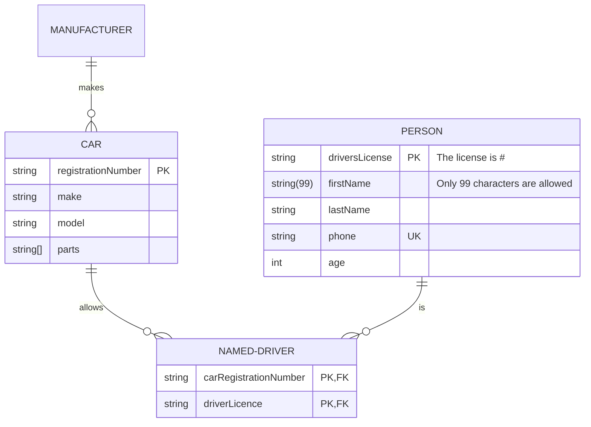

import Tabs from '@theme/Tabs';
import TabItem from '@theme/TabItem';

## Manufacturer

<Tabs groupId="preferred-lang" queryString>
<TabItem value="fsharp" label="F#">

```fsharp
let CAR, NAMED_DRIVER, PERSON, MANUFACTURER = "CAR", "NAMED-DRIVER", "PERSON", "MANUFACTURER"
siren.erDiagram [
    erDiagram.relationship (CAR, erCardinality.onlyOne, NAMED_DRIVER, erCardinality.zeroOrMany, "allows")
    erDiagram.entity (CAR, [
        erDiagram.attribute("string", "registrationNumber", [erKey.pk])
        erDiagram.attribute("string", "make")
        erDiagram.attribute("string", "model")
        erDiagram.attribute("string[]", "parts")
    ])
    erDiagram.relationship (PERSON, erCardinality.onlyOne, NAMED_DRIVER, erCardinality.zeroOrMany, "is")
    erDiagram.entity (PERSON, [
        erDiagram.attribute("string", "driversLicense", [erKey.pk], "The license is #")
        erDiagram.attribute("string(99)", "firstName", comment="Only 99 characters are allowed")
        erDiagram.attribute("string", "lastName")
        erDiagram.attribute("string", "phone", [erKey.uk])
        erDiagram.attribute("int", "age")
    ])
    erDiagram.entity(NAMED_DRIVER, [
        erDiagram.attribute("string", "carRegistrationNumber", [erKey.pk; erKey.fk])
        erDiagram.attribute("string", "driverLicence", [erKey.pk; erKey.fk])
    ])
    erDiagram.relationship(MANUFACTURER,erCardinality.onlyOne,CAR,erCardinality.zeroOrMany,"makes")
]
|> siren.write
```

</TabItem>
<TabItem value="csharp" label="C#">

```csharp
(string CAR, string NAMED_DRIVER, string PERSON, string MANUFACTURER) = ("CAR", "NAMED-DRIVER", "PERSON", "MANUFACTURER");
string actual =
    siren.erDiagram([
        erDiagram.relationship(CAR, erCardinality.onlyOne, NAMED_DRIVER, erCardinality.zeroOrMany, "allows"),
        erDiagram.entity(CAR, new ERAttribute[] {
            erDiagram.attribute("string", "registrationNumber", keys: new ERKeyType[] {erKey.pk }),
            erDiagram.attribute("string", "make"),
            erDiagram.attribute("string", "model"),
            erDiagram.attribute("string[]", "parts")
        }),
        erDiagram.relationship(PERSON, erCardinality.onlyOne, NAMED_DRIVER, erCardinality.zeroOrMany, "is"),
        erDiagram.entity(PERSON, new ERAttribute[] {
            erDiagram.attribute("string", "driversLicense", new ERKeyType[] {erKey.pk }, "The license is #"),
            erDiagram.attribute("string(99)", "firstName", comment: "Only 99 characters are allowed"),
            erDiagram.attribute("string", "lastName"),
            erDiagram.attribute("string", "phone", keys: new ERKeyType[] {erKey.uk}),
            erDiagram.attribute("int", "age")
        }),
        erDiagram.entity(NAMED_DRIVER, new ERAttribute[] {
            erDiagram.attribute("string", "carRegistrationNumber", keys: new ERKeyType[] {erKey.pk, erKey.fk }),
            erDiagram.attribute("string", "driverLicence", keys: new ERKeyType[] {erKey.pk, erKey.fk }),
        }),
        erDiagram.relationship(MANUFACTURER, erCardinality.onlyOne, CAR, erCardinality.zeroOrMany, "makes")
    ]).write();
```

</TabItem>
<TabItem value="py" label="Python">

```py
CAR, NAMED_DRIVER, PERSON, MANUFACTURER = "CAR", "NAMED-DRIVER", "PERSON", "MANUFACTURER"
actual = siren.er_diagram([
    er_diagram.relationship (CAR, er_cardinality.only_one(), NAMED_DRIVER, er_cardinality.zero_or_many(), "allows"),
    er_diagram.entity (CAR, [
        er_diagram.attribute("string", "registrationNumber", [er_key.pk()]),
        er_diagram.attribute("string", "make"),
        er_diagram.attribute("string", "model"),
        er_diagram.attribute("string[]", "parts")
    ]),
    er_diagram.relationship (PERSON, er_cardinality.only_one(), NAMED_DRIVER, er_cardinality.zero_or_many(), "is"),
    er_diagram.entity (PERSON, [
        er_diagram.attribute("string", "driversLicense", [er_key.pk()], "The license is #"),
        er_diagram.attribute("string(99)", "firstName", comment="Only 99 characters are allowed"),
        er_diagram.attribute("string", "lastName"),
        er_diagram.attribute("string", "phone", [er_key.uk()]),
        er_diagram.attribute("int", "age")
    ]),
    er_diagram.entity(NAMED_DRIVER, [
        er_diagram.attribute("string", "carRegistrationNumber", [er_key.pk(), er_key.fk()]),
        er_diagram.attribute("string", "driverLicence", [er_key.pk(), er_key.fk()])
    ]),
    er_diagram.relationship(MANUFACTURER,er_cardinality.only_one(), CAR, er_cardinality.zero_or_many(), "makes")
]).write()
```

</TabItem>
<TabItem value="js" label="JavaScript">

```js
const [CAR, NAMED_DRIVER, PERSON, MANUFACTURER] = ["CAR", "NAMED-DRIVER", "PERSON", "MANUFACTURER"];
const actual = 
  siren.erDiagram([
    erDiagram.relationship (CAR, erCardinality.onlyOne, NAMED_DRIVER, erCardinality.zeroOrMany, "allows"),
    erDiagram.entity (CAR, [
        erDiagram.attribute("string", "registrationNumber", [erKey.pk]),
        erDiagram.attribute("string", "make"),
        erDiagram.attribute("string", "model"),
        erDiagram.attribute("string[]", "parts")
    ]),
    erDiagram.relationship (PERSON, erCardinality.onlyOne, NAMED_DRIVER, erCardinality.zeroOrMany, "is"),
    erDiagram.entity (PERSON, [
        erDiagram.attribute("string", "driversLicense", [erKey.pk], "The license is #"),
        erDiagram.attribute("string(99)", "firstName", null, "Only 99 characters are allowed"),
        erDiagram.attribute("string", "lastName"),
        erDiagram.attribute("string", "phone", [erKey.uk]),
        erDiagram.attribute("int", "age")
    ]),
    erDiagram.entity(NAMED_DRIVER, [
        erDiagram.attribute("string", "carRegistrationNumber", [erKey.pk, erKey.fk]),
        erDiagram.attribute("string", "driverLicence", [erKey.pk, erKey.fk])
    ]),
    erDiagram.relationship(MANUFACTURER,erCardinality.onlyOne, CAR,erCardinality.zeroOrMany, "makes")
]).write();
```

</TabItem>
</Tabs>

{/* output */}

<Tabs>
<TabItem value="graph" label="Graph">

</TabItem>
<TabItem value="output" label="Output">
```yml
erDiagram
    CAR only one to zero or many NAMED-DRIVER : allows
    CAR {
        string registrationNumber PK
        string make
        string model
        string[] parts
    }
    PERSON only one to zero or many NAMED-DRIVER : is
    PERSON {
        string driversLicense PK "The license is #"
        string(99) firstName "Only 99 characters are allowed"
        string lastName
        string phone UK
        int age
    }
    NAMED-DRIVER {
        string carRegistrationNumber PK, FK
        string driverLicence PK, FK
    }
    MANUFACTURER only one to zero or many CAR : makes
```
</TabItem>
</Tabs>