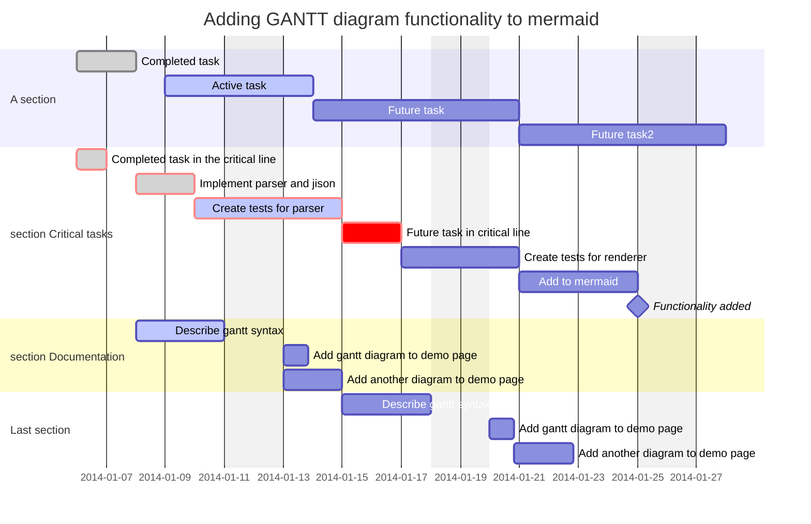

import Tabs from '@theme/Tabs';
import TabItem from '@theme/TabItem';

## Roadmap


<Tabs groupId="preferred-lang" queryString>
<TabItem value="fsharp" label="F#">

```fsharp
let des1, isadded, a1, doc1 = "des1", "isadded", "a1", "doc1"
siren.gantt [
    gantt.dateFormat "YYYY-MM-DD"
    gantt.title "Adding GANTT diagram functionality to mermaid"
    gantt.excludes "weekends"
    gantt.comment """(`excludes` accepts specific dates in YYYY-MM-DD format, days of the week ("sunday") or "weekends", but not the word "weekdays".)"""

    gantt.section "A section"
    gantt.task("Completed task", des1, "2014-01-06", "2014-01-08", [ganttTags.``done``])
    gantt.task("Active task", "des2", "2014-01-09", "3d", [ganttTags.active])
    gantt.task("Future task", "des3", "after des2", "5d")
    gantt.task("Future task2", "des4", "after des3", "5d")

    gantt.section "section Critical tasks"
    gantt.taskStartEnd("Completed task in the critical line", "2014-01-06", "24h", [ganttTags.``done``; ganttTags.crit])
    gantt.taskStartEnd("Implement parser and jison", ganttTime.after des1, "2d", [ganttTags.``done``; ganttTags.crit])
    gantt.taskEnd("Create tests for parser", "3d", [ganttTags.active; ganttTags.crit])
    gantt.taskEnd("Future task in critical line", "2d", [ganttTags.crit])
    gantt.taskEnd("Create tests for renderer", "2d")
    gantt.taskEnd("Add to mermaid", ganttTime.until isadded)
    gantt.milestone("Functionality added", isadded, "2014-01-25", "0d")

    gantt.section "section Documentation"
    gantt.task("Describe gantt syntax", a1, ganttTime.after des1, "3d", [ganttTags.active])
    gantt.taskStartEnd("Add gantt diagram to demo page", ganttTime.after a1, "20h")
    gantt.task("Add another diagram to demo page", doc1, ganttTime.after a1, "48h")

    gantt.section "Last section"
    gantt.taskStartEnd("Describe gantt syntax", ganttTime.after doc1, "3d")
    gantt.taskEnd("Add gantt diagram to demo page", "20h")
    gantt.taskEnd("Add another diagram to demo page", "48h")
]
|> siren.write
```

</TabItem>
<TabItem value="csharp" label="C#">

```csharp
(string des1, string isadded, string a1, string doc1) = ("des1", "isadded", "a1", "doc1");
string actual =
    siren.gantt([
        gantt.dateFormat("YYYY-MM-DD"),
        gantt.title("Adding GANTT diagram functionality to mermaid"),
        gantt.excludes("weekends"),
        gantt.comment("""(`excludes` accepts specific dates in YYYY-MM-DD format, days of the week ("sunday") or "weekends", but not the word "weekdays".)"""),

        gantt.section ("A section"),
        gantt.task("Completed task", des1, "2014-01-06", "2014-01-08", new GanttTags[] {ganttTags.done }),
        gantt.task("Active task", "des2", "2014-01-09", "3d", new GanttTags[] {ganttTags.active}),
        gantt.task("Future task", "des3", "after des2", "5d"),
        gantt.task("Future task2", "des4", "after des3", "5d"),

        gantt.section("section Critical tasks"),
        gantt.taskStartEnd("Completed task in the critical line", "2014-01-06", "24h", new GanttTags[] { ganttTags.done, ganttTags.crit}),
        gantt.taskStartEnd("Implement parser and jison", ganttTime.after(des1), "2d", new GanttTags[] { ganttTags.done, ganttTags.crit}),
        gantt.taskEnd("Create tests for parser", "3d", new GanttTags[] { ganttTags.active, ganttTags.crit}),
        gantt.taskEnd("Future task in critical line", "2d", new GanttTags[] { ganttTags.crit }),
        gantt.taskEnd("Create tests for renderer", "2d"),
        gantt.taskEnd("Add to mermaid", ganttTime.until(isadded)),
        gantt.milestone("Functionality added", isadded, "2014-01-25", "0d"),

        gantt.section("section Documentation"),
        gantt.task("Describe gantt syntax", a1, ganttTime.after(des1), "3d", new GanttTags[] { ganttTags.active }),
        gantt.taskStartEnd("Add gantt diagram to demo page", ganttTime.after (a1), "20h"),
        gantt.task("Add another diagram to demo page", doc1, ganttTime.after (a1), "48h"),

        gantt.section ("Last section"),
        gantt.taskStartEnd("Describe gantt syntax", ganttTime.after (doc1), "3d"),
        gantt.taskEnd("Add gantt diagram to demo page", "20h"),
        gantt.taskEnd("Add another diagram to demo page", "48h")
    ]).write();
```

</TabItem>
<TabItem value="py" label="Python">

```py
des1, isadded, a1, doc1 = "des1", "isadded", "a1", "doc1"
actual: str = (
    siren.gantt([
      gantt.date_format("YYYY-MM-DD"),
      gantt.title("Adding GANTT diagram functionality to mermaid"),
      gantt.excludes("weekends"),
      gantt.comment("(`excludes` accepts specific dates in YYYY-MM-DD format, days of the week (\"sunday\") or \"weekends\", but not the word \"weekdays\".)"),
      
      gantt.section ("A section"),
      gantt.task("Completed task", des1, "2014-01-06", "2014-01-08",[gantt_tags.done()]),
      gantt.task("Active task", "des2", "2014-01-09", "3d", [gantt_tags.active()]),
      gantt.task("Future task", "des3", "after des2", "5d"),
      gantt.task("Future task2", "des4", "after des3", "5d"),
      
      gantt.section("section Critical tasks"),
      gantt.task_start_end("Completed task in the critical line", "2014-01-06", "24h", [gantt_tags.done(), gantt_tags.crit()]),
      gantt.task_start_end("Implement parser and jison", gantt_time.after(des1), "2d", [gantt_tags.done(), gantt_tags.crit()]),
      gantt.task_end("Create tests for parser", "3d", [gantt_tags.active(), gantt_tags.crit()]),
      gantt.task_end("Future task in critical line", "2d", [gantt_tags.crit() ]),
      gantt.task_end("Create tests for renderer", "2d"),
      gantt.task_end("Add to mermaid", gantt_time.until(isadded)),
      gantt.milestone("Functionality added", isadded, "2014-01-25", "0d"),
      
      gantt.section("section Documentation"),
      gantt.task("Describe gantt syntax", a1, gantt_time.after(des1), "3d", [gantt_tags.active()]),
      gantt.task_start_end("Add gantt diagram to demo page", gantt_time.after (a1), "20h"),
      gantt.task("Add another diagram to demo page", doc1, gantt_time.after (a1), "48h"),
      
      gantt.section ("Last section"),
      gantt.task_start_end("Describe gantt syntax", gantt_time.after (doc1), "3d"),
      gantt.task_end("Add gantt diagram to demo page", "20h"),
      gantt.task_end("Add another diagram to demo page", "48h")
    ]).write()
)
```

</TabItem>
<TabItem value="js" label="JavaScript">

```js
const [des1, isadded, a1, doc1] = ["des1", "isadded", "a1", "doc1"];
const actual = 
    siren.gantt([
      gantt.dateFormat("YYYY-MM-DD"),
      gantt.title("Adding GANTT diagram functionality to mermaid"),
      gantt.excludes("weekends"),
      gantt.comment("(`excludes` accepts specific dates in YYYY-MM-DD format, days of the week (\"sunday\") or \"weekends\", but not the word \"weekdays\".)"),
      
      gantt.section ("A section"),
      gantt.task("Completed task", des1, "2014-01-06", "2014-01-08",[ganttTags.done]),
      gantt.task("Active task", "des2", "2014-01-09", "3d", [ganttTags.active]),
      gantt.task("Future task", "des3", "after des2", "5d"),
      gantt.task("Future task2", "des4", "after des3", "5d"),
      
      gantt.section("section Critical tasks"),
      gantt.taskStartEnd("Completed task in the critical line", "2014-01-06", "24h", [ganttTags.done, ganttTags.crit]),
      gantt.taskStartEnd("Implement parser and jison", ganttTime.after(des1), "2d", [ganttTags.done, ganttTags.crit]),
      gantt.taskEnd("Create tests for parser", "3d", [ganttTags.active, ganttTags.crit]),
      gantt.taskEnd("Future task in critical line", "2d", [ganttTags.crit ]),
      gantt.taskEnd("Create tests for renderer", "2d"),
      gantt.taskEnd("Add to mermaid", ganttTime.until(isadded)),
      gantt.milestone("Functionality added", isadded, "2014-01-25", "0d"),
      
      gantt.section("section Documentation"),
      gantt.task("Describe gantt syntax", a1, ganttTime.after(des1), "3d", [ganttTags.active]),
      gantt.taskStartEnd("Add gantt diagram to demo page", ganttTime.after (a1), "20h"),
      gantt.task("Add another diagram to demo page", doc1, ganttTime.after (a1), "48h"),
      
      gantt.section ("Last section"),
      gantt.taskStartEnd("Describe gantt syntax", ganttTime.after (doc1), "3d"),
      gantt.taskEnd("Add gantt diagram to demo page", "20h"),
      gantt.taskEnd("Add another diagram to demo page", "48h")
    ]).write();
```

</TabItem>
</Tabs>

{/* output */}

<Tabs>
<TabItem value="graph" label="Graph">

</TabItem>
<TabItem value="output" label="Output">
```yml
gantt
    dateFormat YYYY-MM-DD
    title Adding GANTT diagram functionality to mermaid
    excludes weekends
    %% (`excludes` accepts specific dates in YYYY-MM-DD format, days of the week (""sunday"") or ""weekends"", but not the word ""weekdays"".)
    section A section
    Completed task : done, des1, 2014-01-06, 2014-01-08
    Active task : active, des2, 2014-01-09, 3d
    Future task : des3, after des2, 5d
    Future task2 : des4, after des3, 5d
    section section Critical tasks
    Completed task in the critical line : done, crit, 2014-01-06, 24h
    Implement parser and jison : done, crit, after des1, 2d
    Create tests for parser : active, crit, 3d
    Future task in critical line : crit, 2d
    Create tests for renderer : 2d
    Add to mermaid : until isadded
    Functionality added : milestone, isadded, 2014-01-25, 0d
    section section Documentation
    Describe gantt syntax : active, a1, after des1, 3d
    Add gantt diagram to demo page : after a1, 20h
    Add another diagram to demo page : doc1, after a1, 48h
    section Last section
    Describe gantt syntax : after doc1, 3d
    Add gantt diagram to demo page : 20h
    Add another diagram to demo page : 48h
```
</TabItem>
</Tabs>