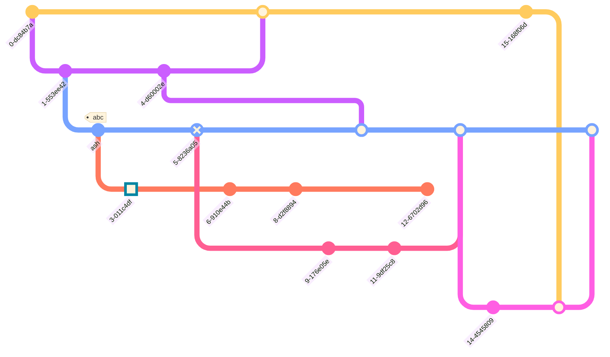

import Tabs from '@theme/Tabs';
import TabItem from '@theme/TabItem';

## Repository


<Tabs groupId="preferred-lang" queryString>
<TabItem value="fsharp" label="F#">

```fsharp
let hotfix, develop, featureA, featureB, main, release = "hotfix", "develop", "featureA", "featureB", "main", "release"
siren.git([
    git.commit()
    git.branch(hotfix)
    git.checkout(hotfix)
    git.commit()
    git.branch(develop)
    git.checkout(develop)
    git.commit("ash",tag="abc")
    git.branch(featureB)
    git.checkout(featureB)
    git.commit(gitType=gitType.highlight)
    git.checkout(main)
    git.checkout(hotfix)
    git.commit(gitType=gitType.normal)
    git.checkout(develop)
    git.commit(gitType=gitType.reverse)
    git.checkout(featureB)
    git.commit()
    git.checkout(main)
    git.merge(hotfix)
    git.checkout(featureB)
    git.commit()
    git.checkout(develop)
    git.branch(featureA)
    git.commit()
    git.checkout(develop)
    git.merge(hotfix)
    git.checkout(featureA)
    git.commit()
    git.checkout(featureB)
    git.commit()
    git.checkout(develop)
    git.merge(featureA)
    git.branch(release)
    git.checkout(release)
    git.commit()
    git.checkout(main)
    git.commit()
    git.checkout(release)
    git.merge(main)
    git.checkout(develop)
    git.merge(release)
])
    .withTheme(theme.``base``)
    .addGraphConfigVariable(gitGraphConfig.showBranches false)
    .write()
```

</TabItem>
<TabItem value="csharp" label="C#">

```csharp
(string hotfix, string develop, string featureA, string featureB, string main, string release) = ("hotfix", "develop", "featureA", "featureB", "main", "release");
string actual =
    siren.git([
        git.commit(),
        git.branch(hotfix),
        git.checkout(hotfix),
        git.commit(),
        git.branch(develop),
        git.checkout(develop),
        git.commit("ash",tag: "abc"),
        git.branch(featureB),
        git.checkout(featureB),
        git.commit(gitType: gitType.highlight),
        git.checkout(main),
        git.checkout(hotfix),
        git.commit(gitType: gitType.normal),
        git.checkout(develop),
        git.commit(gitType: gitType.reverse),
        git.checkout(featureB),
        git.commit(),
        git.checkout(main),
        git.merge(hotfix),
        git.checkout(featureB),
        git.commit(),
        git.checkout(develop),
        git.branch(featureA),
        git.commit(),
        git.checkout(develop),
        git.merge(hotfix),
        git.checkout(featureA),
        git.commit(),
        git.checkout(featureB),
        git.commit(),
        git.checkout(develop),
        git.merge(featureA),
        git.branch(release),
        git.checkout(release),
        git.commit(),
        git.checkout(main),
        git.commit(),
        git.checkout(release),
        git.merge(main),
        git.checkout(develop),
        git.merge(release),
    ])
        .withTheme(theme.@base)
        .addGraphConfigVariable(gitGraphConfig.showBranches(false))
        .write();
```

</TabItem>
<TabItem value="py" label="Python">

```py
hotfix, develop, featureA, featureB, main, release = "hotfix", "develop", "featureA", "featureB", "main", "release"
actual = (
    siren.git([
        git.commit(),
        git.branch(hotfix),
        git.checkout(hotfix),
        git.commit(),
        git.branch(develop),
        git.checkout(develop),
        git.commit("ash", tag = "abc"),
        git.branch(featureB),
        git.checkout(featureB),
        git.commit(git_type = git_type.highlight()),
        git.checkout(main),
        git.checkout(hotfix),
        git.commit(git_type = git_type.normal()),
        git.checkout(develop),
        git.commit(git_type = git_type.reverse()),
        git.checkout(featureB),
        git.commit(),
        git.checkout(main),
        git.merge(hotfix),
        git.checkout(featureB),
        git.commit(),
        git.checkout(develop),
        git.branch(featureA),
        git.commit(),
        git.checkout(develop),
        git.merge(hotfix),
        git.checkout(featureA),
        git.commit(),
        git.checkout(featureB),
        git.commit(),
        git.checkout(develop),
        git.merge(featureA),
        git.branch(release),
        git.checkout(release),
        git.commit(),
        git.checkout(main),
        git.commit(),
        git.checkout(release),
        git.merge(main),
        git.checkout(develop),
        git.merge(release),
    ])
        .with_theme(theme.base())
        .add_graph_config_variable(git_graph_config.show_branches(False))
        .write()
)
```

</TabItem>
<TabItem value="js" label="JavaScript">

```js
const [hotfix, develop, featureA, featureB, main, release] = ["hotfix", "develop", "featureA", "featureB", "main", "release"];
const actual =
    siren.git([
      git.commit(),
      git.branch(hotfix),
      git.checkout(hotfix),
      git.commit(),
      git.branch(develop),
      git.checkout(develop),
      git.commit("ash",null,"abc"),
      git.branch(featureB),
      git.checkout(featureB),
      git.commit(null, gitType.highlight),
      git.checkout(main),
      git.checkout(hotfix),
      git.commit(null, gitType.normal),
      git.checkout(develop),
      git.commit(null, gitType.reverse),
      git.checkout(featureB),
      git.commit(),
      git.checkout(main),
      git.merge(hotfix),
      git.checkout(featureB),
      git.commit(),
      git.checkout(develop),
      git.branch(featureA),
      git.commit(),
      git.checkout(develop),
      git.merge(hotfix),
      git.checkout(featureA),
      git.commit(),
      git.checkout(featureB),
      git.commit(),
      git.checkout(develop),
      git.merge(featureA),
      git.branch(release),
      git.checkout(release),
      git.commit(),
      git.checkout(main),
      git.commit(),
      git.checkout(release),
      git.merge(main),
      git.checkout(develop),
      git.merge(release),
  ])
      .withTheme(theme.base)
      .addGraphConfigVariable(gitGraphConfig.showBranches(false))
      .write();
```

</TabItem>
</Tabs>

{/* output */}

<Tabs>
<TabItem value="graph" label="Graph">

</TabItem>
<TabItem value="output" label="Output">
```yml
---
config:
    theme: base
    gitGraph:
        showBranches: false
---
gitGraph
    commit
    branch hotfix
    checkout hotfix
    commit
    branch develop
    checkout develop
    commit id: "ash" tag: "abc"
    branch featureB
    checkout featureB
    commit type: HIGHLIGHT
    checkout main
    checkout hotfix
    commit type: NORMAL
    checkout develop
    commit type: REVERSE
    checkout featureB
    commit
    checkout main
    merge hotfix
    checkout featureB
    commit
    checkout develop
    branch featureA
    commit
    checkout develop
    merge hotfix
    checkout featureA
    commit
    checkout featureB
    commit
    checkout develop
    merge featureA
    branch release
    checkout release
    commit
    checkout main
    commit
    checkout release
    merge main
    checkout develop
    merge release
```
</TabItem>
</Tabs>