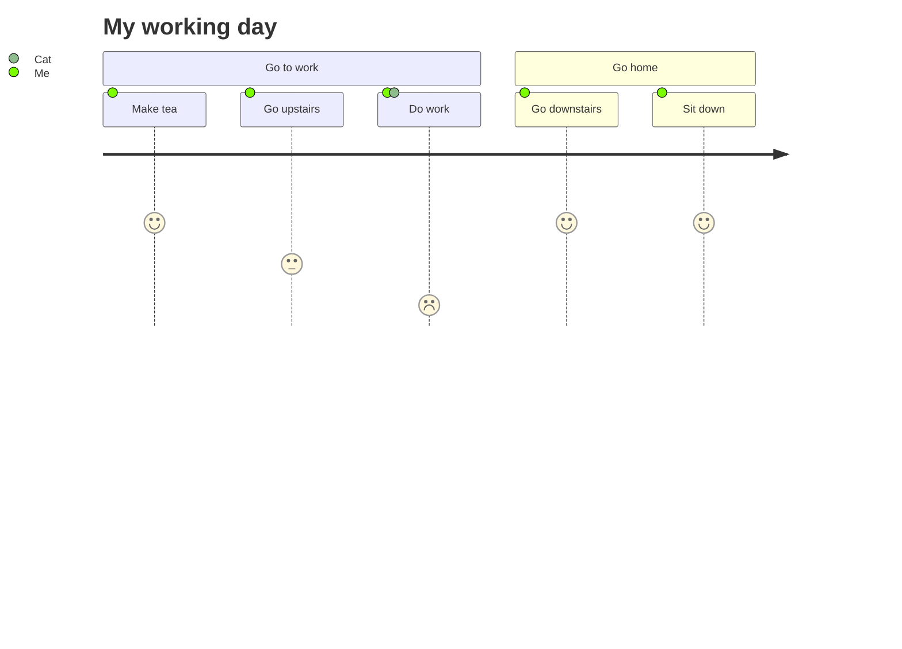

import Tabs from '@theme/Tabs';
import TabItem from '@theme/TabItem';

The following classes can be useful when creating journey diagrams:

- `siren`
- `journey`
- `journeyConfig`

## Workday

<Tabs groupId="preferred-lang" queryString>
<TabItem value="fsharp" label="F#">

```fsharp
let Me, Cat = "Me", "Cat"
siren.journey [
    journey.title "My working day"
    journey.section "Go to work"
    journey.task("Make tea", 5, [Me])
    journey.task("Go upstairs", 3, [Me])
    journey.task("Do work", 1, [Me; Cat])
    journey.section "Go home"
    journey.task("Go downstairs", 5, [Me])
    journey.task("Sit down", 5, [Me])
]
|> siren.write
```

</TabItem>
<TabItem value="csharp" label="C#">

```csharp
(string Me, string Cat) = ("Me", "Cat");
string actual = siren.journey([
    journey.title("My working day"),
    journey.section("Go to work"),
    journey.task("Make tea", 5, [Me]),
    journey.task("Go upstairs", 3, [Me]),
    journey.task("Do work", 1, [Me, Cat]),
    journey.section("Go home"),
    journey.task("Go downstairs", 5, [Me]),
    journey.task("Sit down", 5, [Me])
]).write();
```

</TabItem>
<TabItem value="py" label="Python">

```py
Me, Cat = "Me", "Cat"
actual = (
    siren.journey([
        journey.title("My working day"),
        journey.section("Go to work"),
        journey.task("Make tea", 5, [Me]),
        journey.task("Go upstairs", 3, [Me]),
        journey.task("Do work", 1, [Me, Cat]),
        journey.section("Go home"),
        journey.task("Go downstairs", 5, [Me]),
        journey.task("Sit down", 5, [Me])
    ]).write()
)
```

</TabItem>
<TabItem value="js" label="JavaScript">

```js
const [Me, Cat] = ["Me", "Cat"];
const actual = 
    siren.journey([
        journey.title("My working day"),
        journey.section("Go to work"),
        journey.task("Make tea", 5, [Me]),
        journey.task("Go upstairs", 3, [Me]),
        journey.task("Do work", 1, [Me, Cat]),
        journey.section("Go home"),
        journey.task("Go downstairs", 5, [Me]),
        journey.task("Sit down", 5, [Me])
    ]).write();
```

</TabItem>
</Tabs>

{/* output */}

<Tabs>
<TabItem value="graph" label="Graph">

</TabItem>
<TabItem value="output" label="Output">
```yml
journey
    title My working day
    section Go to work
    Make tea: 5: Me
    Go upstairs: 3: Me
    Do work: 1: Me, Cat
    section Go home
    Go downstairs: 5: Me
    Sit down: 5: Me
```
</TabItem>
</Tabs>