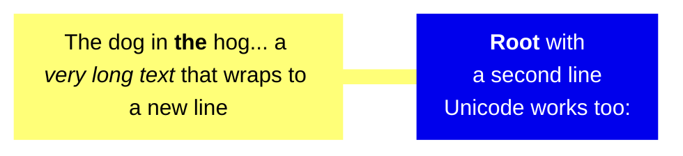

import Tabs from '@theme/Tabs';
import TabItem from '@theme/TabItem';

The following classes can be useful when creating mindmaps:

- `siren`
- `mindmap`
- `mindmapConfig`

## Example


<Tabs groupId="preferred-lang" queryString>
<TabItem value="fsharp" label="F#">

```fsharp
siren.mindmap [
    mindmap.circleId("root","mindmap", [

        mindmap.node("Origins", [
            mindmap.node "Long history"
            mindmap.icon "fa fa-book"
            mindmap.node ("Popularisation", [
                mindmap.node "British popular psychology author Tony Buzan"
            ])
        ])

        mindmap.node("Research",[
            mindmap.node "On effectiveness<br/>and features"
            mindmap.node ("On Automatic creation", [
                mindmap.node ("Uses", [
                    mindmap.node "Creative techniques"
                    mindmap.node "Strategic planning"
                    mindmap.node "Argument mapping"
                ])
            ])
        ])

        mindmap.node ("Tools",[
            mindmap.node "Pen and paper"
            mindmap.node "Mermaid"
        ])
    ])
]
|> siren.write
```

</TabItem>
<TabItem value="csharp" label="C#">

```csharp
siren.mindmap([
    mindmap.circleId("root", "mindmap", new MindmapElement[] {

        mindmap.node("Origins", new MindmapElement[] {
            mindmap.node ("Long history"),
            mindmap.icon ("fa fa-book"),
            mindmap.node ("Popularisation", new MindmapElement[] {
                mindmap.node("British popular psychology author Tony Buzan")
            })
        }),

        mindmap.node("Research", new MindmapElement[] {
            mindmap.node ("On effectiveness<br/>and features"),
            mindmap.node ("On Automatic creation", new MindmapElement[] {
                mindmap.node ("Uses", new MindmapElement[] {
                    mindmap.node ("Creative techniques"),
                    mindmap.node ("Strategic planning"),
                    mindmap.node ("Argument mapping")
                })
            })
        }),

        mindmap.node ("Tools", new MindmapElement[] {
            mindmap.node ("Pen and paper"),
            mindmap.node ("Mermaid")
        })
    })
]).write();
```

</TabItem>
<TabItem value="py" label="Python">

```py
siren.mindmap([
    mindmap.circle_id("root", "mindmap", [

        mindmap.node("Origins", [
            mindmap.node ("Long history"),
            mindmap.icon ("fa fa-book"),
            mindmap.node ("Popularisation", [
                mindmap.node("British popular psychology author Tony Buzan")
            ])
        ]),

        mindmap.node("Research", [
            mindmap.node ("On effectiveness<br/>and features"),
            mindmap.node ("On Automatic creation", [
                mindmap.node ("Uses", [
                    mindmap.node ("Creative techniques"),
                    mindmap.node ("Strategic planning"),
                    mindmap.node ("Argument mapping")
                ])
            ])
        ]),

        mindmap.node ("Tools", [
            mindmap.node ("Pen and paper"),
            mindmap.node ("Mermaid")
        ])
    ])
]).write()
```

</TabItem>
<TabItem value="js" label="JavaScript">

```js
siren.mindmap([
    mindmap.circleId("root", "mindmap", [

        mindmap.node("Origins", [
            mindmap.node ("Long history"),
            mindmap.icon ("fa fa-book"),
            mindmap.node ("Popularisation", [
                mindmap.node("British popular psychology author Tony Buzan")
            ])
        ]),

        mindmap.node("Research", [
            mindmap.node ("On effectiveness<br/>and features"),
            mindmap.node ("On Automatic creation", [
                mindmap.node ("Uses", [
                    mindmap.node ("Creative techniques"),
                    mindmap.node ("Strategic planning"),
                    mindmap.node ("Argument mapping")
                ])
            ])
        ]),

        mindmap.node ("Tools", [
            mindmap.node ("Pen and paper"),
            mindmap.node ("Mermaid")
        ])
    ])
]).write();
```

</TabItem>
</Tabs>

{/* output */}

<Tabs>
<TabItem value="graph" label="Graph">

</TabItem>
<TabItem value="output" label="Output">
```yml
mindmap
    root((mindmap))
        Origins
            Long history
            ::icon(fa fa-book)
            Popularisation
                British popular psychology author Tony Buzan
        Research
            On effectiveness<br/>and features
            On Automatic creation
                Uses
                    Creative techniques
                    Strategic planning
                    Argument mapping
        Tools
            Pen and paper
            Mermaid
```
</TabItem>
</Tabs>

## Markdown


<Tabs groupId="preferred-lang" queryString>
<TabItem value="fsharp" label="F#">

```fsharp
siren.mindmap [
    mindmap.squareId(
        "id1",
        formatting.markdown """**Root** with
a second line
Unicode works too: """, [
        mindmap.squareId("id2", formatting.markdown """The dog in **the** hog... a *very long text* that wraps to a new line""")
    ])
]
|> siren.write
```

</TabItem>
<TabItem value="csharp" label="C#">

```csharp
siren.mindmap([
    mindmap.squareId(
        "id1",
        formatting.markdown(@"**Root** with
a second line
Unicode works too: "), new MindmapElement[] {
        mindmap.squareId("id2", formatting.markdown(@"The dog in **the** hog... a *very long text* that wraps to a new line"))
    })
]).write();
```

</TabItem>
<TabItem value="py" label="Python">

```py
siren.mindmap([
    mindmap.square_id(
        "id1",
        formatting.markdown("""**Root** with
a second line
Unicode works too: """), [
        mindmap.square_id("id2", formatting.markdown("The dog in **the** hog... a *very long text* that wraps to a new line"))
    ])
]).write()
```

</TabItem>
<TabItem value="js" label="JavaScript">

```js
siren.mindmap([
    mindmap.squareId(
        "id1",
        formatting.markdown(`**Root** with
a second line
Unicode works too: `), [
        mindmap.squareId("id2", formatting.markdown("The dog in **the** hog... a *very long text* that wraps to a new line"))
    ])
]).write();
```

</TabItem>
</Tabs>

{/* output */}

<Tabs>
<TabItem value="graph" label="Graph">

</TabItem>
<TabItem value="output" label="Output">
```yml
mindmap
    id1["`**Root** with
a second line
Unicode works too: `"]
        id2["`The dog in **the** hog... a *very long text* that wraps to a new line`"]
```
</TabItem>
</Tabs>