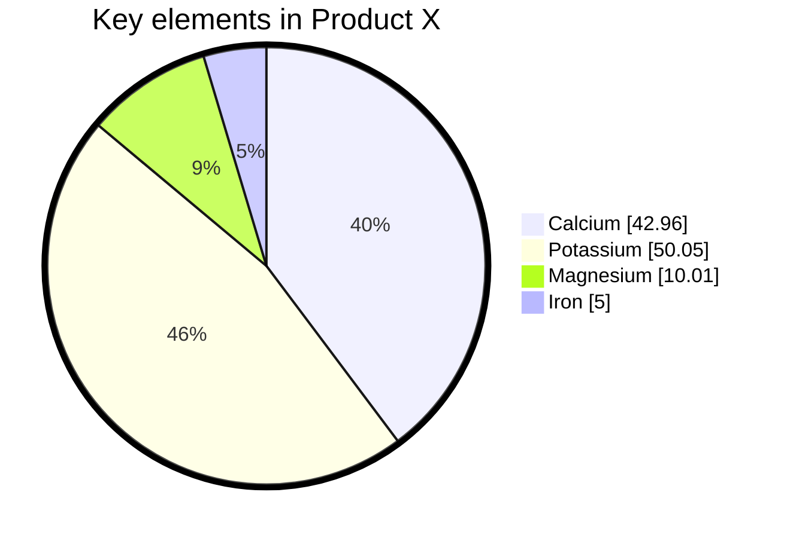

import Tabs from '@theme/Tabs';
import TabItem from '@theme/TabItem';

The following classes can be useful when creating pie charts:

- `siren`
- `pieChart`
- `pieTheme`
- `pieConfig`

## Product

<Tabs groupId="preferred-lang" queryString>
<TabItem value="fsharp" label="F#">

```fsharp
siren.pieChart ([
    pieChart.data("Calcium", 42.96)
    pieChart.data("Potassium", 50.05)
    pieChart.data("Magnesium", 10.01)
    pieChart.data("Iron", 5)
], true, "Key elements in Product X")
|> siren.addGraphConfigVariable(pieConfig.textPosition 0.5)
|> siren.addThemeVariable(pieTheme.pieOuterStrokeWidth "5px")
|> siren.write
```

</TabItem>
<TabItem value="csharp" label="C#">

```csharp
siren.pieChart([
    pieChart.data("Calcium", 42.96),
    pieChart.data("Potassium", 50.05),
    pieChart.data("Magnesium", 10.01),
    pieChart.data("Iron", 5)
], true, "Key elements in Product X")
    .addGraphConfigVariable(pieConfig.textPosition(0.5))
    .addThemeVariable(pieTheme.pieOuterStrokeWidth("5px"))
    .write();
```

</TabItem>
<TabItem value="py" label="Python">

```py
siren.pie_chart([
    pie_chart.data("Calcium", 42.96),
    pie_chart.data("Potassium", 50.05),
    pie_chart.data("Magnesium", 10.01),
    pie_chart.data("Iron", 5)
], True, "Key elements in Product X")
  .add_graph_config_variable(pie_config.text_position(0.5))
  .add_theme_variable(pie_theme.pie_outer_stroke_width("5px"))
  .write()
```

</TabItem>
<TabItem value="js" label="JavaScript">

```js
siren.pieChart([
    pieChart.data("Calcium", 42.96),
    pieChart.data("Potassium", 50.05),
    pieChart.data("Magnesium", 10.01),
    pieChart.data("Iron", 5)
], true, "Key elements in Product X")
  .addGraphConfigVariable(pieConfig.textPosition(0.5))
  .addThemeVariable(pieTheme.pieOuterStrokeWidth("5px"))
  .write();
```

</TabItem>
</Tabs>

{/* output */}

<Tabs>
<TabItem value="graph" label="Graph">

</TabItem>
<TabItem value="output" label="Output">
```yml
---
config:
    pie:
        textPosition: 0.5
    themeVariables:
        pieOuterStrokeWidth: 5px
---
pie showData title Key elements in Product X
    "Calcium" : 42.96
    "Potassium" : 50.05
    "Magnesium" : 10.01
    "Iron" : 5
```
</TabItem>
</Tabs>