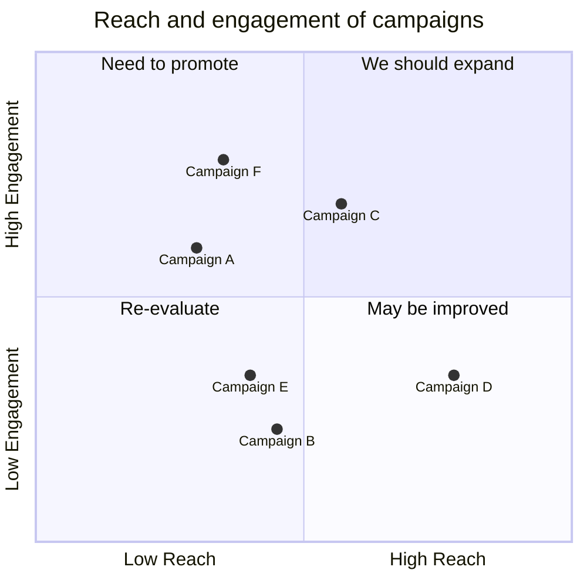

import Tabs from '@theme/Tabs';
import TabItem from '@theme/TabItem';

## Engagement

<Tabs groupId="preferred-lang" queryString>
<TabItem value="fsharp" label="F#">

```fsharp
siren.quadrant [
    quadrant.title "Reach and engagement of campaigns" 
    quadrant.xAxis ("Low Reach", "High Reach")
    quadrant.yAxis ("Low Engagement", "High Engagement")
    quadrant.comment "Labels start here"
    quadrant.quadrant1 "We should expand"
    quadrant.quadrant2 "Need to promote"
    quadrant.quadrant3 "Re-evaluate"
    quadrant.quadrant4 "May be improved"

    quadrant.point("Campaign A", 0.3, 0.6)
    quadrant.point("Campaign B", 0.45, 0.23)
    quadrant.point("Campaign C", 0.57, 0.69)
    quadrant.point("Campaign D", 0.78, 0.34)
    quadrant.point("Campaign E", 0.40, 0.34)
    quadrant.point("Campaign F", 0.35, 0.78)
]
|> siren.write
```

</TabItem>
<TabItem value="csharp" label="C#">

```csharp
siren.quadrant([
    quadrant.title("Reach and engagement of campaigns"),
    quadrant.xAxis("Low Reach", "High Reach"),
    quadrant.yAxis("Low Engagement", "High Engagement"),
    quadrant.comment("Labels start here"),
    quadrant.quadrant1("We should expand"),
    quadrant.quadrant2("Need to promote"),
    quadrant.quadrant3("Re-evaluate"),
    quadrant.quadrant4("May be improved"),

    quadrant.point("Campaign A", 0.3, 0.6),
    quadrant.point("Campaign B", 0.45, 0.23),
    quadrant.point("Campaign C", 0.57, 0.69),
    quadrant.point("Campaign D", 0.78, 0.34),
    quadrant.point("Campaign E", 0.40, 0.34),
    quadrant.point("Campaign F", 0.35, 0.78),
]).write();
```

</TabItem>
<TabItem value="py" label="Python">

```py
siren.quadrant([
    quadrant.title("Reach and engagement of campaigns"),
    quadrant.x_axis("Low Reach", "High Reach"),
    quadrant.y_axis("Low Engagement", "High Engagement"),
    quadrant.comment("Labels start here"),
    quadrant.quadrant1("We should expand"),
    quadrant.quadrant2("Need to promote"),
    quadrant.quadrant3("Re-evaluate"),
    quadrant.quadrant4("May be improved"),

    quadrant.point("Campaign A", 0.3, 0.6),
    quadrant.point("Campaign B", 0.45, 0.23),
    quadrant.point("Campaign C", 0.57, 0.69),
    quadrant.point("Campaign D", 0.78, 0.34),
    quadrant.point("Campaign E", 0.40, 0.34),
    quadrant.point("Campaign F", 0.35, 0.78),
]).write()
```

</TabItem>
<TabItem value="js" label="JavaScript">

```js
siren.quadrant([
    quadrant.title("Reach and engagement of campaigns"),
    quadrant.xAxis("Low Reach", "High Reach"),
    quadrant.yAxis("Low Engagement", "High Engagement"),
    quadrant.comment("Labels start here"),
    quadrant.quadrant1("We should expand"),
    quadrant.quadrant2("Need to promote"),
    quadrant.quadrant3("Re-evaluate"),
    quadrant.quadrant4("May be improved"),

    quadrant.point("Campaign A", 0.3, 0.6),
    quadrant.point("Campaign B", 0.45, 0.23),
    quadrant.point("Campaign C", 0.57, 0.69),
    quadrant.point("Campaign D", 0.78, 0.34),
    quadrant.point("Campaign E", 0.40, 0.34),
    quadrant.point("Campaign F", 0.35, 0.78),
]).write();
```

</TabItem>
</Tabs>

{/* output */}

<Tabs>
<TabItem value="graph" label="Graph">

</TabItem>
<TabItem value="output" label="Output">
```yml
quadrantChart
    title Reach and engagement of campaigns
    x-axis Low Reach --> High Reach
    y-axis Low Engagement --> High Engagement
    %% Labels start here
    quadrant-1 We should expand
    quadrant-2 Need to promote
    quadrant-3 Re-evaluate
    quadrant-4 May be improved
    Campaign A: [0.30, 0.60]
    Campaign B: [0.45, 0.23]
    Campaign C: [0.57, 0.69]
    Campaign D: [0.78, 0.34]
    Campaign E: [0.40, 0.34]
    Campaign F: [0.35, 0.78]
```
</TabItem>
</Tabs>