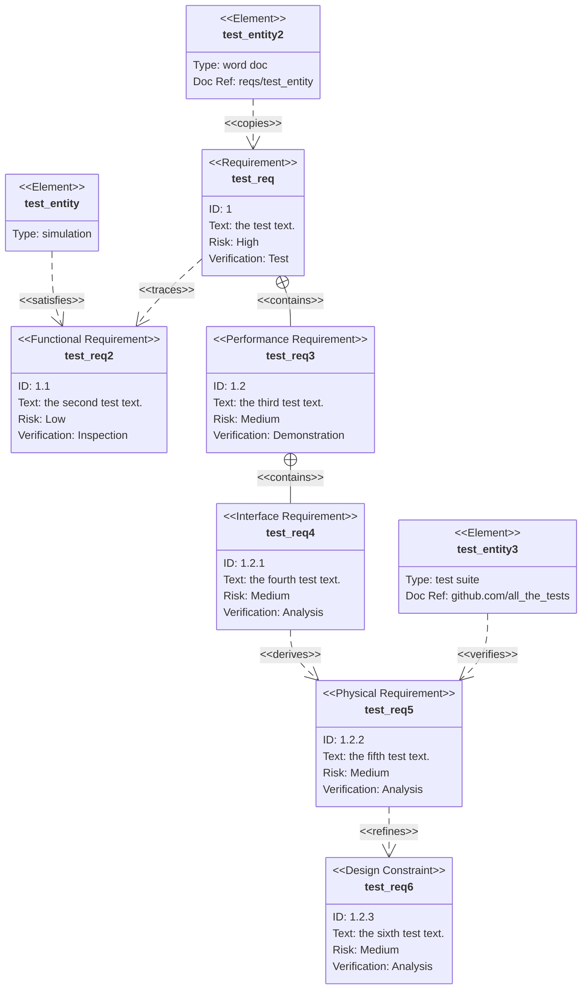

import Tabs from '@theme/Tabs';
import TabItem from '@theme/TabItem';

## Large Example

<Tabs groupId="preferred-lang" queryString>
<TabItem value="fsharp" label="F#">

```fsharp
siren.requirement [
    requirement.requirement("test_req", "1", "the test text.", rqRisk.high, rqMethod.test)

    requirement.functionalRequirement("test_req2", "1.1", "the second test text.", rqRisk.low, rqMethod.inspection)

    requirement.performanceRequirement ("test_req3", "1.2", "the third test text.", rqRisk.medium, rqMethod.demonstration)

    requirement.interfaceRequirement ("test_req4", "1.2.1", "the fourth test text.", rqRisk.medium, rqMethod.analysis)

    requirement.physicalRequirement ("test_req5", "1.2.2", "the fifth test text.", rqRisk.medium, rqMethod.analysis)

    requirement.designConstraint ("test_req6", "1.2.3", "the sixth test text.", rqRisk.medium, rqMethod.analysis)

    requirement.element("test_entity", "simulation")
    requirement.element("test_entity2", "word doc", "reqs/test_entity")
    requirement.element("test_entity3", "test suite", "github.com/all_the_tests")

    requirement.satisfies ("test_entity", "test_req2")
    requirement.traces ("test_req", "test_req2")
    requirement.contains ("test_req", "test_req3")
    requirement.contains ("test_req3", "test_req4")
    requirement.derives ("test_req4", "test_req5")
    requirement.refines ("test_req5", "test_req6")
    requirement.verifies ("test_entity3", "test_req5")
    requirement.copies ("test_entity2", "test_req")
]
|> siren.write
```

</TabItem>
<TabItem value="csharp" label="C#">

```csharp
siren.requirement([
    Requirement.requirement("test_req", "1", "the test text.", rqRisk.high, rqMethod.test),

    Requirement.functionalRequirement("test_req2", "1.1", "the second test text.", rqRisk.low, rqMethod.inspection),

    Requirement.performanceRequirement("test_req3", "1.2", "the third test text.", rqRisk.medium, rqMethod.demonstration),

    Requirement.interfaceRequirement("test_req4", "1.2.1", "the fourth test text.", rqRisk.medium, rqMethod.analysis),

    Requirement.physicalRequirement("test_req5", "1.2.2", "the fifth test text.", rqRisk.medium, rqMethod.analysis),

    Requirement.designConstraint("test_req6", "1.2.3", "the sixth test text.", rqRisk.medium, rqMethod.analysis),

    Requirement.element("test_entity", "simulation"),
    Requirement.element("test_entity2", "word doc", "reqs/test_entity"),
    Requirement.element("test_entity3", "test suite", "github.com/all_the_tests"),

    Requirement.satisfies("test_entity", "test_req2"),
    Requirement.traces("test_req", "test_req2"),
    Requirement.contains("test_req", "test_req3"),
    Requirement.contains("test_req3", "test_req4"),
    Requirement.derives("test_req4", "test_req5"),
    Requirement.refines("test_req5", "test_req6"),
    Requirement.verifies("test_entity3", "test_req5"),
    Requirement.copies("test_entity2", "test_req"),
]).write();
```

</TabItem>
<TabItem value="py" label="Python">

```py
siren.requirement([
    requirement.requirement("test_req", "1", "the test text.", rq_risk.high(), rq_method.test()),

    requirement.functional_requirement("test_req2", "1.1", "the second test text.", rq_risk.low(), rq_method.inspection()),

    requirement.performance_requirement("test_req3", "1.2", "the third test text.", rq_risk.medium(), rq_method.demonstration()),

    requirement.interface_requirement("test_req4", "1.2.1", "the fourth test text.", rq_risk.medium(), rq_method.analysis()),

    requirement.physical_requirement("test_req5", "1.2.2", "the fifth test text.", rq_risk.medium(), rq_method.analysis()),

    requirement.design_constraint("test_req6", "1.2.3", "the sixth test text.", rq_risk.medium(), rq_method.analysis()),

    requirement.element("test_entity", "simulation"),
    requirement.element("test_entity2", "word doc", "reqs/test_entity"),
    requirement.element("test_entity3", "test suite", "github.com/all_the_tests"),

    requirement.satisfies("test_entity", "test_req2"),
    requirement.traces("test_req", "test_req2"),
    requirement.contains("test_req", "test_req3"),
    requirement.contains("test_req3", "test_req4"),
    requirement.derives("test_req4", "test_req5"),
    requirement.refines("test_req5", "test_req6"),
    requirement.verifies("test_entity3", "test_req5"),
    requirement.copies("test_entity2", "test_req"),
]).write()
```

</TabItem>
<TabItem value="js" label="JavaScript">

```js
siren.requirement([
    requirement.requirement("test_req", "1", "the test text.", rqRisk.high, rqMethod.test),

    requirement.functionalRequirement("test_req2", "1.1", "the second test text.", rqRisk.low, rqMethod.inspection),

    requirement.performanceRequirement("test_req3", "1.2", "the third test text.", rqRisk.medium, rqMethod.demonstration),

    requirement.interfaceRequirement("test_req4", "1.2.1", "the fourth test text.", rqRisk.medium, rqMethod.analysis),

    requirement.physicalRequirement("test_req5", "1.2.2", "the fifth test text.", rqRisk.medium, rqMethod.analysis),

    requirement.designConstraint("test_req6", "1.2.3", "the sixth test text.", rqRisk.medium, rqMethod.analysis),

    requirement.element("test_entity", "simulation"),
    requirement.element("test_entity2", "word doc", "reqs/test_entity"),
    requirement.element("test_entity3", "test suite", "github.com/all_the_tests"),

    requirement.satisfies("test_entity", "test_req2"),
    requirement.traces("test_req", "test_req2"),
    requirement.contains("test_req", "test_req3"),
    requirement.contains("test_req3", "test_req4"),
    requirement.derives("test_req4", "test_req5"),
    requirement.refines("test_req5", "test_req6"),
    requirement.verifies("test_entity3", "test_req5"),
    requirement.copies("test_entity2", "test_req"),
]).write();
```

</TabItem>
</Tabs>

{/* output */}

<Tabs>
<TabItem value="graph" label="Graph">

</TabItem>
<TabItem value="output" label="Output">
```yml
requirementDiagram
    requirement test_req {
        id: "1"
        text: "the test text."
        risk: high
        verifymethod: test
    }
    functionalRequirement test_req2 {
        id: "1.1"
        text: "the second test text."
        risk: low
        verifymethod: inspection
    }
    performanceRequirement test_req3 {
        id: "1.2"
        text: "the third test text."
        risk: medium
        verifymethod: demonstration
    }
    interfaceRequirement test_req4 {
        id: "1.2.1"
        text: "the fourth test text."
        risk: medium
        verifymethod: analysis
    }
    physicalRequirement test_req5 {
        id: "1.2.2"
        text: "the fifth test text."
        risk: medium
        verifymethod: analysis
    }
    designConstraint test_req6 {
        id: "1.2.3"
        text: "the sixth test text."
        risk: medium
        verifymethod: analysis
    }
    element test_entity {
        type: "simulation"
    }
    element test_entity2 {
        type: "word doc"
        docRef: "reqs/test_entity"
    }
    element test_entity3 {
        type: "test suite"
        docRef: "github.com/all_the_tests"
    }
    test_entity - satisfies -> test_req2
    test_req - traces -> test_req2
    test_req - contains -> test_req3
    test_req3 - contains -> test_req4
    test_req4 - derives -> test_req5
    test_req5 - refines -> test_req6
    test_entity3 - verifies -> test_req5
    test_entity2 - copies -> test_req
```
</TabItem>
</Tabs>