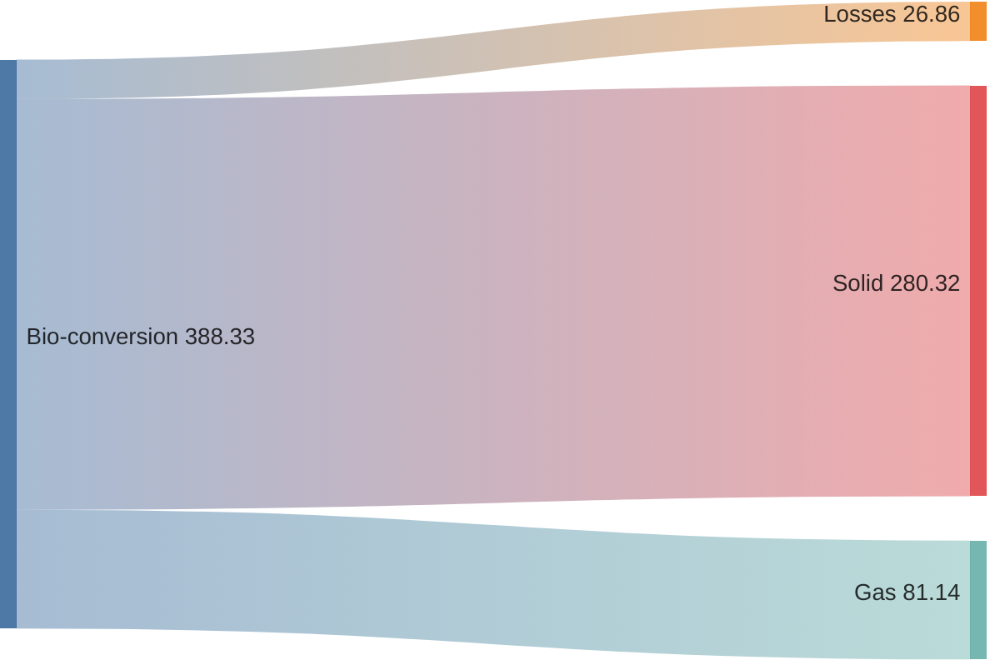

import Tabs from '@theme/Tabs';
import TabItem from '@theme/TabItem';

The following classes can be useful when creating requirement diagrams:

- `siren`
- `sankey`
- `sankeyConfig`

## Bio conversion


<Tabs groupId="preferred-lang" queryString>
<TabItem value="fsharp" label="F#">

```fsharp
siren.sankey [
    sankey.links("Bio-conversion", [
        "Losses", 26.862
        "Solid", 280.322
        "Gas", 81.144
    ])
]
|> siren.write
```

</TabItem>
<TabItem value="csharp" label="C#">

```csharp
siren.sankey([
    sankey.links("Bio-conversion", [
        ("Losses", 26.862),
        ("Solid", 280.322),
        ("Gas", 81.144)
    ])
]).write();
```

</TabItem>
<TabItem value="py" label="Python">

```py
siren.sankey([
    sankey.links("Bio-conversion", [
        ("Losses", 26.862),
        ("Solid", 280.322),
        ("Gas", 81.144)
    ])
]).write()
```

</TabItem>
<TabItem value="js" label="JavaScript">

```js
siren.sankey([
    sankey.links("Bio-conversion", [
        ["Losses", 26.862],
        ["Solid", 280.322],
        ["Gas", 81.144]
    ])
]).write();
```

</TabItem>
</Tabs>

{/* output */}

<Tabs>
<TabItem value="graph" label="Graph">

</TabItem>
<TabItem value="output" label="Output">
```yml
sankey-beta
"Bio-conversion","Losses",26.862000
"Bio-conversion","Solid",280.322000
"Bio-conversion","Gas",81.144000
```
</TabItem>
</Tabs>