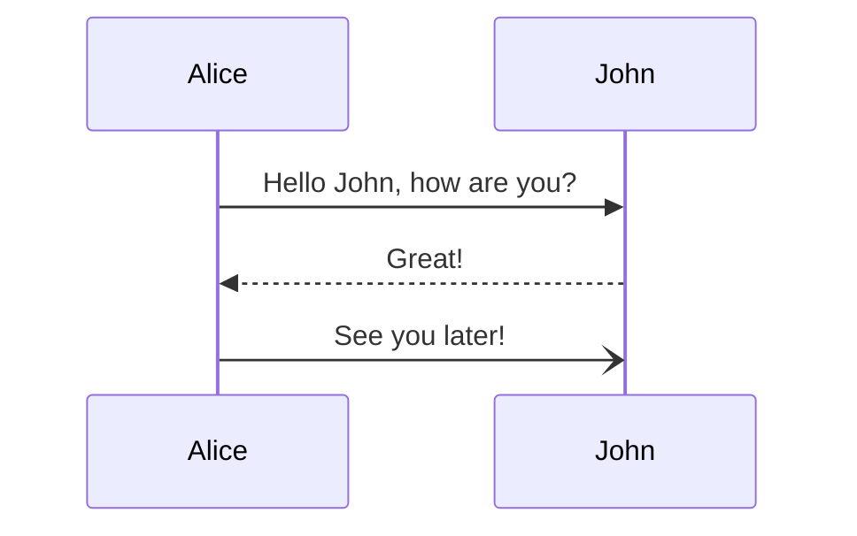
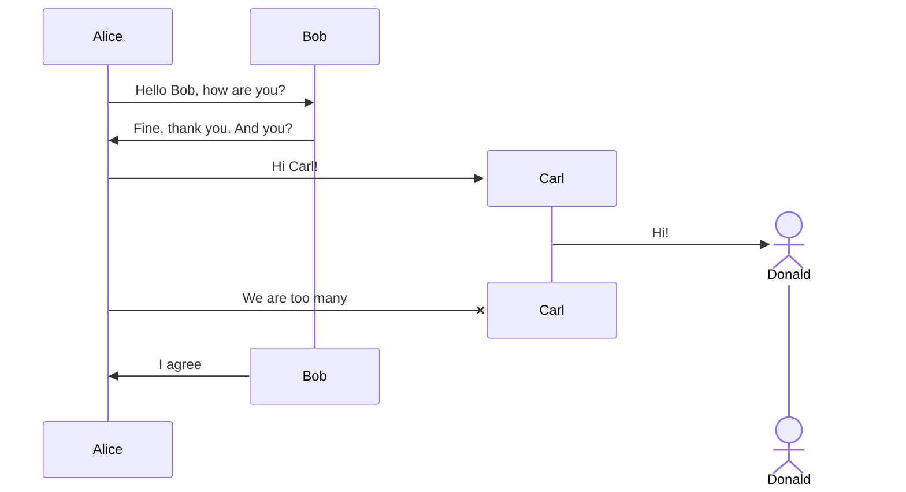
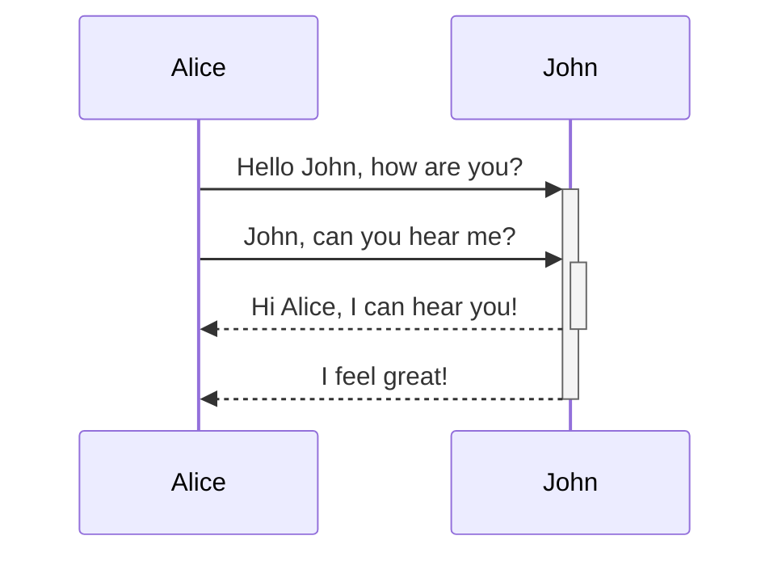
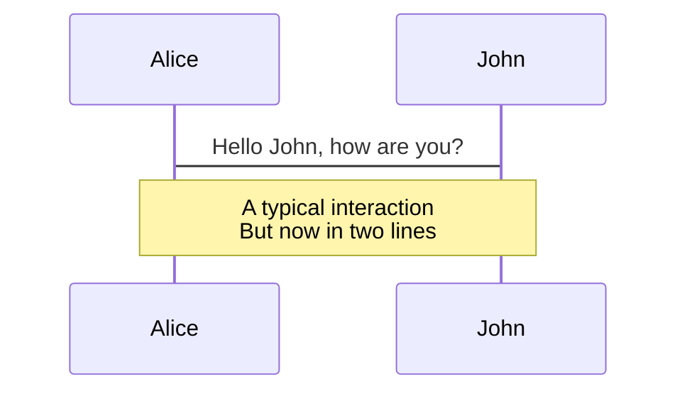
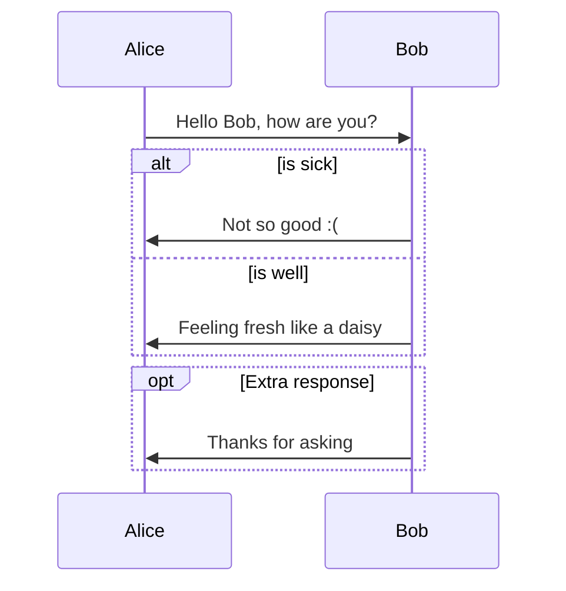
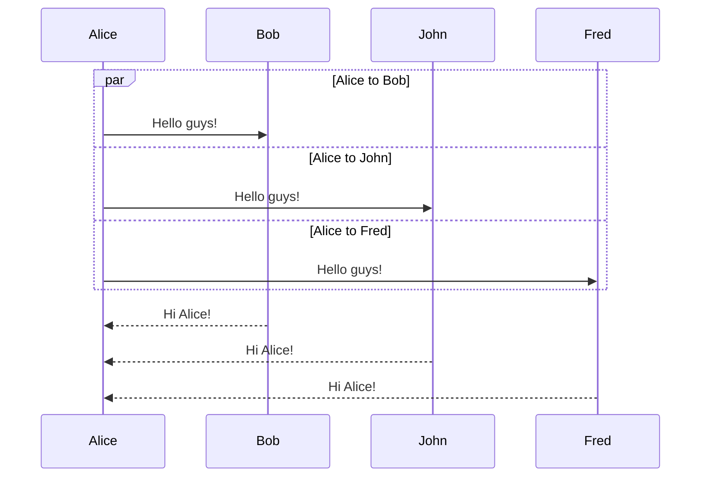
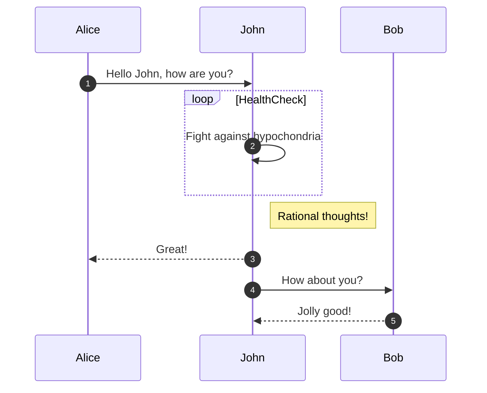
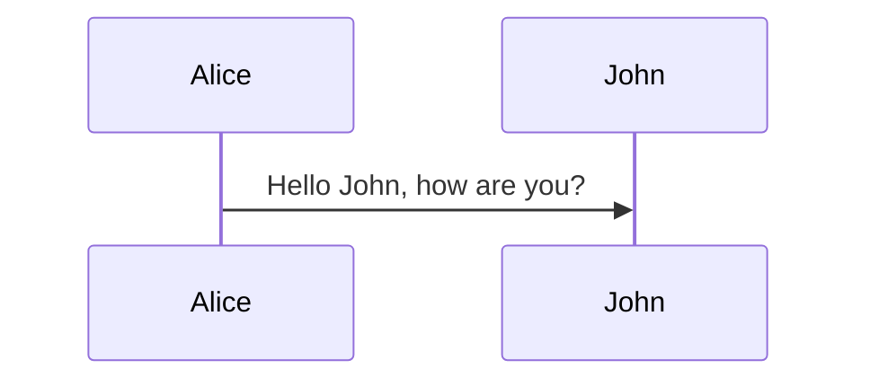

import Tabs from '@theme/Tabs';
import TabItem from '@theme/TabItem';

## Simple

<Tabs groupId="preferred-lang" queryString>
<TabItem value="fsharp" label="F#">

```fsharp
siren.sequence [
    sequence.messageArrow( "Alice",  "John", "Hello John, how are you?")
    sequence.messageDottedArrow( "John",  "Alice", "Great!")
    sequence.messageOpenArrow( "Alice",  "John", "See you later!")
]
|> siren.write
```

</TabItem>
<TabItem value="csharp" label="C#">

```csharp
siren.sequence([
    sequence.messageArrow( "Alice",  "John", "Hello John, how are you?"),
    sequence.messageDottedArrow( "John",  "Alice", "Great!"),
    sequence.messageOpenArrow( "Alice",  "John", "See you later!")
]).write();
```

</TabItem>
<TabItem value="py" label="Python">

```py
siren.sequence([
    sequence.message_arrow( "Alice",  "John", "Hello John, how are you?"),
    sequence.message_dotted_arrow( "John",  "Alice", "Great!"),
    sequence.message_open_arrow( "Alice",  "John", "See you later!")
]).write()
```

</TabItem>
<TabItem value="js" label="JavaScript">

```js
siren.sequence([
    sequence.messageArrow( "Alice",  "John", "Hello John, how are you?"),
    sequence.messageDottedArrow( "John",  "Alice", "Great!"),
    sequence.messageOpenArrow( "Alice",  "John", "See you later!")
]).write();
```

</TabItem>
</Tabs>

{/* output */}

<Tabs>
<TabItem value="graph" label="Graph">

</TabItem>
<TabItem value="output" label="Output">
```yml
sequenceDiagram
    Alice->>John: Hello John, how are you?
    John-->>Alice: Great!
    Alice-)John: See you later!
```
</TabItem>
</Tabs>

## Create / destroy

<Tabs groupId="preferred-lang" queryString>
<TabItem value="fsharp" label="F#">

```fsharp
let alice, bob, carl, donald = "Alice", "Bob", "Carl", "D"
siren.sequence [
    sequence.messageArrow(alice, bob, "Hello Bob, how are you?")
    sequence.messageArrow(bob, alice, "Fine, thank you. And you?")
    sequence.createParticipant carl
    sequence.messageArrow(alice, carl, "Hi Carl!")
    sequence.createActor(donald, "Donald")
    sequence.messageArrow(carl, donald, "Hi!")
    sequence.destroy carl
    sequence.messageCross(alice, carl, "We are too many")
    sequence.destroy bob
    sequence.messageArrow(bob, alice, "I agree")
]
|> siren.write
```

</TabItem>
<TabItem value="csharp" label="C#">

```csharp
(string alice, string bob, string carl, string donald) = ("Alice", "Bob", "Carl", "D");
siren.sequence([
    sequence.messageArrow(alice, bob, "Hello Bob, how are you?"),
    sequence.messageArrow(bob, alice, "Fine, thank you. And you?"),
    sequence.createParticipant (carl),
    sequence.messageArrow(alice, carl, "Hi Carl!"),
    sequence.createActor(donald, "Donald"),
    sequence.messageArrow(carl, donald, "Hi!"),
    sequence.destroy (carl),
    sequence.messageCross(alice, carl, "We are too many"),
    sequence.destroy (bob),
    sequence.messageArrow(bob, alice, "I agree")
]).write();
```

</TabItem>
<TabItem value="py" label="Python">

```py
alice, bob, carl, donald = "Alice", "Bob", "Carl", "D"
siren.sequence ([
    sequence.message_arrow(alice, bob, "Hello Bob, how are you?"),
    sequence.message_arrow(bob, alice, "Fine, thank you. And you?"),
    sequence.create_participant(carl),
    sequence.message_arrow(alice, carl, "Hi Carl!"),
    sequence.create_actor(donald, "Donald"),
    sequence.message_arrow(carl, donald, "Hi!"),
    sequence.destroy(carl),
    sequence.message_cross(alice, carl, "We are too many"),
    sequence.destroy(bob),
    sequence.message_arrow(bob, alice, "I agree"),
]).write()
```

</TabItem>
<TabItem value="js" label="JavaScript">

```js
const [alice, bob, carl, donald] =  ["Alice", "Bob", "Carl", "D"]
siren.sequence([
    sequence.messageArrow(alice, bob, "Hello Bob, how are you?"),
    sequence.messageArrow(bob, alice, "Fine, thank you. And you?"),
    sequence.createParticipant (carl),
    sequence.messageArrow(alice, carl, "Hi Carl!"),
    sequence.createActor(donald, "Donald"),
    sequence.messageArrow(carl, donald, "Hi!"),
    sequence.destroy (carl),
    sequence.messageCross(alice, carl, "We are too many"),
    sequence.destroy (bob),
    sequence.messageArrow(bob, alice, "I agree")
]).write();
```

</TabItem>
</Tabs>

{/* output */}

<Tabs>
<TabItem value="graph" label="Graph">

</TabItem>
<TabItem value="output" label="Output">
```yml
sequenceDiagram
    Alice->>Bob: Hello Bob, how are you?
    Bob->>Alice: Fine, thank you. And you?
    create participant Carl
    Alice->>Carl: Hi Carl!
    create actor D as Donald
    Carl->>D: Hi!
    destroy Carl
    Alice-xCarl: We are too many
    destroy Bob
    Bob->>Alice: I agree
```
</TabItem>
</Tabs>

## Nested activation

<Tabs groupId="preferred-lang" queryString>
<TabItem value="fsharp" label="F#">

```fsharp
let alice, john = "Alice", "John"
siren.sequence [
    sequence.messageArrow(alice, john, "Hello John, how are you?", true)
    sequence.messageArrow(alice, john, "John, can you hear me?", true)
    sequence.messageDottedArrow(john, alice, "Hi Alice, I can hear you!", false)
    sequence.messageDottedArrow(john, alice, "I feel great!", false)
]
|> siren.write
```

</TabItem>
<TabItem value="csharp" label="C#">

```csharp
(string alice, string john) = ("Alice", "John");
siren.sequence([
    sequence.messageArrow(alice, john, "Hello John, how are you?", true),
    sequence.messageArrow(alice, john, "John, can you hear me?", true),
    sequence.messageDottedArrow(john, alice, "Hi Alice, I can hear you!", false),
    sequence.messageDottedArrow(john, alice, "I feel great!", false)
]).write();
```

</TabItem>
<TabItem value="py" label="Python">

```py
alice, john = "Alice", "John"
siren.sequence([
    sequence.message_arrow(alice, john, "Hello John, how are you?", True),
    sequence.message_arrow(alice, john, "John, can you hear me?", True),
    sequence.message_dotted_arrow(john, alice, "Hi Alice, I can hear you!", False),
    sequence.message_dotted_arrow(john, alice, "I feel great!", False)
]).write()
```

</TabItem>
<TabItem value="js" label="JavaScript">

```js
const [alice, john] =  ["Alice", "John"]
siren.sequence([
    sequence.messageArrow(alice, john, "Hello John, how are you?", true),
    sequence.messageArrow(alice, john, "John, can you hear me?", true),
    sequence.messageDottedArrow(john, alice, "Hi Alice, I can hear you!", false),
    sequence.messageDottedArrow(john, alice, "I feel great!", false)
]).write();
```

</TabItem>
</Tabs>

{/* output */}

<Tabs>
<TabItem value="graph" label="Graph">

</TabItem>
<TabItem value="output" label="Output">
```yml
sequenceDiagram
    Alice->>+John: Hello John, how are you?
    Alice->>+John: John, can you hear me?
    John-->>-Alice: Hi Alice, I can hear you!
    John-->>-Alice: I feel great!
```
</TabItem>
</Tabs>

## Note

<Tabs groupId="preferred-lang" queryString>
<TabItem value="fsharp" label="F#">

```fsharp
let alice, john = "Alice", "John"
siren.sequence [
    sequence.message(alice, john, "Hello John, how are you?")
    sequence.noteSpanning(alice, john, "A typical interaction<br/>But now in two lines", notePosition.over)
]
|> siren.write
```

</TabItem>
<TabItem value="csharp" label="C#">

```csharp
(string alice, string john) = ("Alice", "John");
siren.sequence([
    sequence.message(alice, john, "Hello John, how are you?"),
    sequence.noteSpanning(alice, john, "A typical interaction<br/>But now in two lines", notePosition.over)
]).write();
```

</TabItem>
<TabItem value="py" label="Python">

```py
alice, john = "Alice", "John"
siren.sequence([
    sequence.message(alice, john, "Hello John, how are you?"),
    sequence.note_spanning(alice, john, "A typical interaction<br/>But now in two lines", note_position.over())
]).write()
```

</TabItem>
<TabItem value="js" label="JavaScript">

```js
const [alice, john] =  ["Alice", "John"]
siren.sequence([
    sequence.message(alice, john, "Hello John, how are you?"),
    sequence.noteSpanning(alice, john, "A typical interaction<br/>But now in two lines", notePosition.over)
]).write();
```

</TabItem>
</Tabs>

{/* output */}

<Tabs>
<TabItem value="graph" label="Graph">

</TabItem>
<TabItem value="output" label="Output">
```yml
sequenceDiagram
    Alice->John: Hello John, how are you?
    note over Alice,John : A typical interaction<br/>But now in two lines
```
</TabItem>
</Tabs>

## Alt else opt

<Tabs groupId="preferred-lang" queryString>
<TabItem value="fsharp" label="F#">

```fsharp
siren.sequence [
    sequence.messageArrow("Alice", "Bob", "Hello Bob, how are you?")
    sequence.alt ("is sick", [
        sequence.messageArrow("Bob", "Alice", "Not so good :(")
    ], 
    [
        // One else condition
        "is well", [
            sequence.messageArrow("Bob", "Alice", "Feeling fresh like a daisy")
        ]
    ])
    sequence.opt ("Extra response", [
        sequence.messageArrow("Bob", "Alice", "Thanks for asking")
    ])
] 
|> siren.write
```

</TabItem>
<TabItem value="csharp" label="C#">

```csharp
siren.sequence([
    sequence.messageArrow("Alice", "Bob", "Hello Bob, how are you?"),
    sequence.alt ("is sick", [
        sequence.messageArrow("Bob", "Alice", "Not so good :(")
    ],
    [
        // One else condition
        ("is well", [
            sequence.messageArrow("Bob", "Alice", "Feeling fresh like a daisy")
        ])
    ]),
    sequence.opt ("Extra response", [
        sequence.messageArrow("Bob", "Alice", "Thanks for asking")
    ])
]).write();
```

</TabItem>
<TabItem value="py" label="Python">

```py
alice, bob = "Alice", "Bob"
siren.sequence([
    sequence.message_arrow(alice, bob, "Hello Bob, how are you?"),
    sequence.alt("is sick", [
        sequence.message_arrow(bob, alice, "Not so good :(")
    ], 
    [
        # One else condition
        ("is well", [
            sequence.message_arrow(bob, alice, "Feeling fresh like a daisy")
        ])
    ]),
    sequence.opt ("Extra response", [
        sequence.message_arrow(bob, alice, "Thanks for asking")
    ])
]).write()
```

</TabItem>
<TabItem value="js" label="JavaScript">

```js
siren.sequence([
    sequence.messageArrow("Alice", "Bob", "Hello Bob, how are you?"),
    sequence.alt (
        "is sick", 
        [sequence.messageArrow("Bob", "Alice", "Not so good :(")], 
        [
            // One else condition
            ["is well", [
                sequence.messageArrow("Bob", "Alice", "Feeling fresh like a daisy")
            ]]
        ]
    ),
    sequence.opt ("Extra response", [
        sequence.messageArrow("Bob", "Alice", "Thanks for asking")
    ])
]).write();
```

</TabItem>
</Tabs>

{/* output */}

<Tabs>
<TabItem value="graph" label="Graph">

</TabItem>
<TabItem value="output" label="Output">
```yml
sequenceDiagram
    Alice->>Bob: Hello Bob, how are you?
    alt is sick
        Bob->>Alice: Not so good :(
    else is well
        Bob->>Alice: Feeling fresh like a daisy
    end
    opt Extra response
        Bob->>Alice: Thanks for asking
    end
```
</TabItem>
</Tabs>

## Parallel

<Tabs groupId="preferred-lang" queryString>
<TabItem value="fsharp" label="F#">

```fsharp
siren.sequence [
    sequence.par ("Alice to Bob", [
            sequence.messageArrow("Alice", "Bob", "Hello guys!")
    ], [
        "Alice to John", [
            sequence.messageArrow("Alice", "John", "Hello guys!")
        ]
        "Alice to Fred", [
            sequence.messageArrow("Alice", "Fred", "Hello guys!")
        ]
    ])
    sequence.messageDottedArrow("Bob", "Alice", "Hi Alice!")
    sequence.messageDottedArrow("John", "Alice", "Hi Alice!")
    sequence.messageDottedArrow("Fred", "Alice", "Hi Alice!")
] 
|> siren.write
```

</TabItem>
<TabItem value="csharp" label="C#">

```csharp
siren.sequence([
    sequence.par (
        "Alice to Bob", 
        [sequence.messageArrow("Alice", "Bob", "Hello guys!")], 
        [
            ("Alice to John", [
                sequence.messageArrow("Alice", "John", "Hello guys!")
            ]),
            ("Alice to Fred", [
                sequence.messageArrow("Alice", "Fred", "Hello guys!")
            ])
        ]
    ),
    sequence.messageDottedArrow("Bob", "Alice", "Hi Alice!"),
    sequence.messageDottedArrow("John", "Alice", "Hi Alice!"),
    sequence.messageDottedArrow("Fred", "Alice", "Hi Alice!")
]).write();
```

</TabItem>
<TabItem value="py" label="Python">

```py
siren.sequence([
    sequence.par("Alice to Bob", [
            sequence.message_arrow(alice, bob, "Hello guys!")
    ], [
        ("Alice to John", [
            sequence.message_arrow(alice, john, "Hello guys!")
        ]),
        ("Alice to Fred", [
            sequence.message_arrow(alice, fred, "Hello guys!")
        ])
    ]),
    sequence.message_dotted_arrow(bob, alice, "Hi Alice!"),
    sequence.message_dotted_arrow(john, alice, "Hi Alice!"),
    sequence.message_dotted_arrow(fred, alice, "Hi Alice!")
]).write()
```

</TabItem>
<TabItem value="js" label="JavaScript">

```js
siren.sequence([
    sequence.par ("Alice to Bob", [
            sequence.messageArrow("Alice", "Bob", "Hello guys!")
    ], [
        ["Alice to John", [
            sequence.messageArrow("Alice", "John", "Hello guys!")
        ]],
        ["Alice to Fred", [
            sequence.messageArrow("Alice", "Fred", "Hello guys!")
        ]]
    ]),
    sequence.messageDottedArrow("Bob", "Alice", "Hi Alice!"),
    sequence.messageDottedArrow("John", "Alice", "Hi Alice!"),
    sequence.messageDottedArrow("Fred", "Alice", "Hi Alice!")
]).write();
```

</TabItem>
</Tabs>

{/* output */}

<Tabs>
<TabItem value="graph" label="Graph">

</TabItem>
<TabItem value="output" label="Output">
```yml
sequenceDiagram
    par Alice to Bob
        Alice->>Bob: Hello guys!
    and Alice to John
        Alice->>John: Hello guys!
    and Alice to Fred
        Alice->>Fred: Hello guys!
    end
    Bob-->>Alice: Hi Alice!
    John-->>Alice: Hi Alice!
    Fred-->>Alice: Hi Alice!
```
</TabItem>
</Tabs>

## Autonumber loop

<Tabs groupId="preferred-lang" queryString>
<TabItem value="fsharp" label="F#">

```fsharp
let alice, john, bob = "Alice", "John", "Bob"
siren.sequence [
    sequence.autoNumber
    sequence.messageArrow(alice, john, "Hello John, how are you?")
    sequence.loop("HealthCheck", [
        sequence.messageArrow(john, john, "Fight against hypochondria")
    ])
    sequence.note(john, "Rational thoughts!", notePosition.rightOf)
    sequence.messageDottedArrow(john, alice, "Great!")
    sequence.messageArrow(john, bob, "How about you?")
    sequence.messageDottedArrow(bob, john, "Jolly good!")
] 
|> siren.write
```

</TabItem>
<TabItem value="csharp" label="C#">

```csharp
(string alice, string john, string bob) = ("Alice", "John", "Bob");
siren.sequence([
    sequence.autoNumber,
    sequence.messageArrow(alice, john, "Hello John, how are you?"),
    sequence.loop("HealthCheck", [
        sequence.messageArrow(john, john, "Fight against hypochondria")
    ]),
    sequence.note(john, "Rational thoughts!", notePosition.rightOf),
    sequence.messageDottedArrow(john, alice, "Great!"),
    sequence.messageArrow(john, bob, "How about you?"),
    sequence.messageDottedArrow(bob, john, "Jolly good!")
]).write();
```

</TabItem>
<TabItem value="py" label="Python">

```py
alice, john, bob = "Alice", "John", "Bob"
siren.sequence([
    sequence.auto_number(),
    sequence.message_arrow(alice, john, "Hello John, how are you?"),
    sequence.loop("HealthCheck", [
        sequence.message_arrow(john, john, "Fight against hypochondria")
    ]),
    sequence.note(john, "Rational thoughts!", note_position.right_of()),
    sequence.message_dotted_arrow(john, alice, "Great!"),
    sequence.message_arrow(john, bob, "How about you?"),
    sequence.message_dotted_arrow(bob, john, "Jolly good!")
]).write()
```

</TabItem>
<TabItem value="js" label="JavaScript">

```js
const [alice, john, bob] = ["Alice", "John", "Bob"]
siren.sequence([
    sequence.autoNumber,
    sequence.messageArrow(alice, john, "Hello John, how are you?"),
    sequence.loop("HealthCheck", [
        sequence.messageArrow(john, john, "Fight against hypochondria")
    ]),
    sequence.note(john, "Rational thoughts!", notePosition.rightOf),
    sequence.messageDottedArrow(john, alice, "Great!"),
    sequence.messageArrow(john, bob, "How about you?"),
    sequence.messageDottedArrow(bob, john, "Jolly good!")
]).write();
```

</TabItem>
</Tabs>

{/* output */}

<Tabs>
<TabItem value="graph" label="Graph">

</TabItem>
<TabItem value="output" label="Output">
```yml
sequenceDiagram
    autonumber
    Alice->>John: Hello John, how are you?
    loop HealthCheck
        John->>John: Fight against hypochondria
    end
    note right of John : Rational thoughts!
    John-->>Alice: Great!
    John->>Bob: How about you?
    Bob-->>John: Jolly good!
```
</TabItem>
</Tabs>

## Actor links

<Tabs groupId="preferred-lang" queryString>
<TabItem value="fsharp" label="F#">

```fsharp
siren.sequence [
    sequence.participant "Alice"
    sequence.participant "John"
    sequence.link("Alice", "Dashboard", "https://dashboard.contoso.com/alice")
    sequence.link("Alice", "Wiki", "https://wiki.contoso.com/alice")
    sequence.link("John", "Dashboard", "https://dashboard.contoso.com/john")
    sequence.link("John", "Wiki", "https://wiki.contoso.com/john")
    sequence.messageArrow( "Alice",  "John", "Hello John, how are you?")
]
|> siren.write
```

</TabItem>
<TabItem value="csharp" label="C#">

```csharp
(string alice, string john) = ("Alice", "John");
siren.sequence([
    sequence.participant(alice),
    sequence.participant(john),
    sequence.link(alice, "Dashboard", "https://dashboard.contoso.com/alice"),
    sequence.link(alice, "Wiki", "https://wiki.contoso.com/alice"),
    sequence.link(john, "Dashboard", "https://dashboard.contoso.com/john"),
    sequence.link(john, "Wiki", "https://wiki.contoso.com/john"),
    sequence.messageArrow( alice, john, "Hello John, how are you?")
]).write();
```

</TabItem>
<TabItem value="py" label="Python">

```py
alice, john = "Alice", "John"
siren.sequence([
    sequence.participant(alice), 
    sequence.participant(john), 
    sequence.link(alice, "Dashboard", "https://dashboard.contoso.com/alice"),
    sequence.link(alice, "Wiki", "https://wiki.contoso.com/alice"),
    sequence.link(john, "Dashboard", "https://dashboard.contoso.com/john"),
    sequence.link(john, "Wiki", "https://wiki.contoso.com/john"),
    sequence.message_arrow(alice, john, "Hello John, how are you?")
]).write()
```

</TabItem>
<TabItem value="js" label="JavaScript">

```js
const [alice, john] = ["Alice", "John"]
siren.sequence([
    sequence.participant(alice),
    sequence.participant(john),
    sequence.link(alice, "Dashboard", "https://dashboard.contoso.com/alice"),
    sequence.link(alice, "Wiki", "https://wiki.contoso.com/alice"),
    sequence.link(john, "Dashboard", "https://dashboard.contoso.com/john"),
    sequence.link(john, "Wiki", "https://wiki.contoso.com/john"),
    sequence.messageArrow(alice, john, "Hello John, how are you?")
]).write();
```

</TabItem>
</Tabs>

{/* output */}

<Tabs>
<TabItem value="graph" label="Graph">

</TabItem>
<TabItem value="output" label="Output">
```yml
sequenceDiagram
    participant Alice
    participant John
    link Alice: Dashboard @ https://dashboard.contoso.com/alice
    link Alice: Wiki @ https://wiki.contoso.com/alice
    link John: Dashboard @ https://dashboard.contoso.com/john
    link John: Wiki @ https://wiki.contoso.com/john
    Alice->>John: Hello John, how are you?
```
</TabItem>
</Tabs>