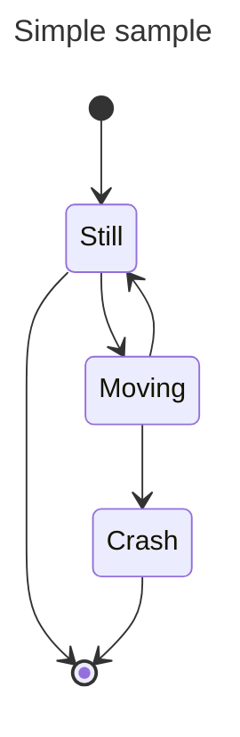
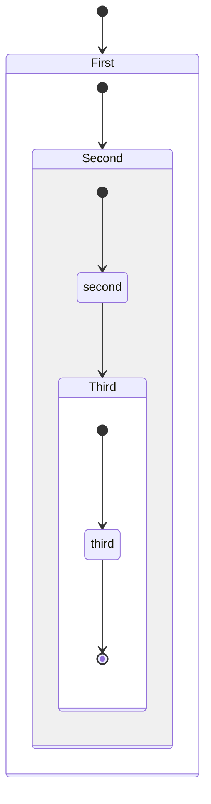
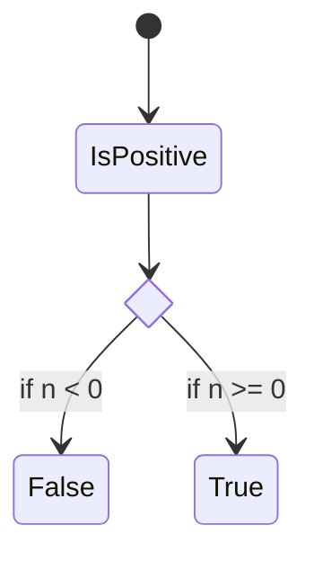
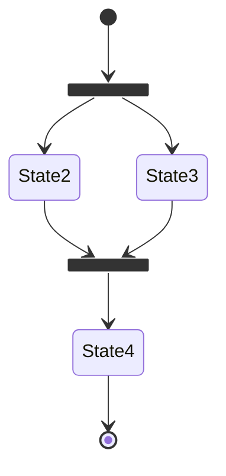
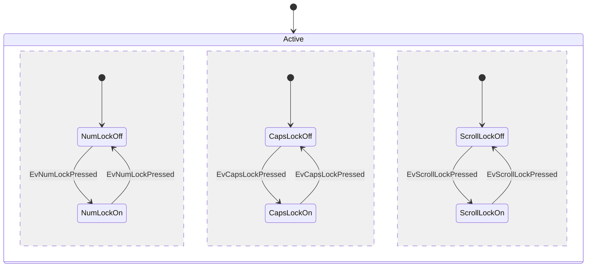
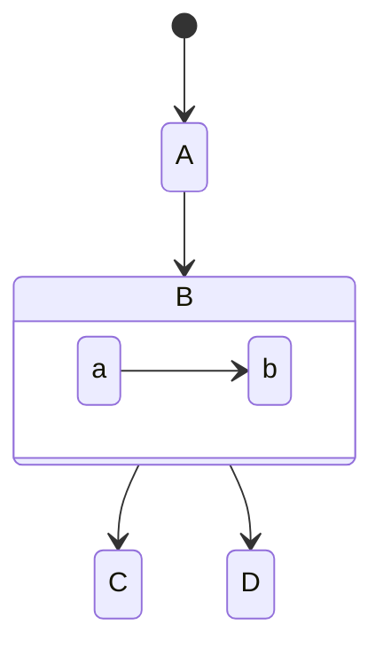

import Tabs from '@theme/Tabs';
import TabItem from '@theme/TabItem';

## Simple

<Tabs groupId="preferred-lang" queryString>
<TabItem value="fsharp" label="F#">

```fsharp
let Still, Moving, Crash = "Still", "Moving", "Crash"
siren.stateV2 [
    stateDiagram.transitionStart(Still)
    stateDiagram.transitionEnd(Still)
    stateDiagram.transition(Still, Moving)
    stateDiagram.transition(Moving, Still)
    stateDiagram.transition(Moving, Crash)
    stateDiagram.transitionEnd(Crash)
]
|> siren.withTitle("Simple sample")
|> siren.write
```

</TabItem>
<TabItem value="csharp" label="C#">

```csharp
(string Still, string Moving, string Crash) = ("Still", "Moving", "Crash");
string actual = siren.stateV2([
    stateDiagram.transitionStart(Still),
    stateDiagram.transitionEnd(Still),
    stateDiagram.transition(Still, Moving),
    stateDiagram.transition(Moving, Still),
    stateDiagram.transition(Moving, Crash),
    stateDiagram.transitionEnd(Crash)
    ]).withTitle("Simple sample").write();
```

</TabItem>
<TabItem value="py" label="Python">

```py
Still, Moving, Crash = "Still", "Moving", "Crash"
actual: str = (
    siren.state_v2([
        state_diagram.transition_start(Still),
        state_diagram.transition_end(Still),
        state_diagram.transition(Still, Moving),
        state_diagram.transition(Moving, Still),
        state_diagram.transition(Moving, Crash),
        state_diagram.transition_end(Crash)
    ])
      .with_title("Simple sample")
      .write()
)
```

</TabItem>
<TabItem value="js" label="JavaScript">

```js
let [Still, Moving, Crash] = ["Still", "Moving", "Crash"] 
const actual = 
    siren.stateV2([
        stateDiagram.transitionStart(Still),
        stateDiagram.transitionEnd(Still),
        stateDiagram.transition(Still, Moving),
        stateDiagram.transition(Moving, Still),
        stateDiagram.transition(Moving, Crash),
        stateDiagram.transitionEnd(Crash)
    ]).withTitle("Simple sample").write();
```

</TabItem>
</Tabs>

{/* output */}

<Tabs>
<TabItem value="graph" label="Graph">

</TabItem>
<TabItem value="output" label="Output">
```yml
---
title: Simple sample
---
stateDiagram-v2
    [*] --> Still
    Still --> [*]
    Still --> Moving
    Moving --> Still
    Moving --> Crash
    Crash --> [*]
```
</TabItem>
</Tabs>

## Composite

<Tabs groupId="preferred-lang" queryString>
<TabItem value="fsharp" label="F#">

```fsharp
let First, Second, second, Third, third = "First", "Second", "second", "Third", "third"
siren.stateV2 [
    stateDiagram.transition (stateDiagram.startEnd,First)
    stateDiagram.stateComposite(First, [
        stateDiagram.transition(stateDiagram.startEnd, Second)

        stateDiagram.stateComposite(Second, [
            stateDiagram.transition(stateDiagram.startEnd, second)
            stateDiagram.transition(second, Third)

            stateDiagram.stateComposite(Third, [
                stateDiagram.transition(stateDiagram.startEnd, third)
                stateDiagram.transition(third, stateDiagram.startEnd)
            ])
        ])
    ])
]
|> siren.write
```

</TabItem>
<TabItem value="csharp" label="C#">

```csharp
(string First, string Second, string second, string Third, string third) = ("First", "Second", "second", "Third", "third");
string actual = siren.stateV2([
    stateDiagram.transition (stateDiagram.startEnd,First),
    stateDiagram.stateComposite(First, [
        stateDiagram.transition(stateDiagram.startEnd, Second),

        stateDiagram.stateComposite(Second, [
            stateDiagram.transition(stateDiagram.startEnd, second),
            stateDiagram.transition(second, Third),

            stateDiagram.stateComposite(Third, [
                stateDiagram.transition(stateDiagram.startEnd, third),
                stateDiagram.transition(third, stateDiagram.startEnd)
            ])
        ])
    ])
]).write();
```

</TabItem>
<TabItem value="py" label="Python">

```py
First, Second, second, Third, third =  "First", "Second", "second", "Third", "third"
actual: str = (
    siren.state_v2([
        state_diagram.transition (state_diagram.start_end(), First),
        state_diagram.state_composite(First, [
            state_diagram.transition(state_diagram.start_end(), Second),

            state_diagram.state_composite(Second, [
                state_diagram.transition(state_diagram.start_end(), second),
                state_diagram.transition(second, Third),

                state_diagram.state_composite(Third, [
                    state_diagram.transition(state_diagram.start_end(), third),
                    state_diagram.transition(third, state_diagram.start_end())
                ])
            ])
        ])
    ])
      .write()
)
```

</TabItem>
<TabItem value="js" label="JavaScript">

```js
let [First, Second, second, Third, third] = ["First", "Second", "second", "Third", "third"] 
const actual = 
    siren.stateV2([
        stateDiagram.transition (stateDiagram.startEnd,First),
        stateDiagram.stateComposite(First, [
            stateDiagram.transition(stateDiagram.startEnd, Second),
        
            stateDiagram.stateComposite(Second, [
                stateDiagram.transition(stateDiagram.startEnd, second),
                stateDiagram.transition(second, Third),
        
                stateDiagram.stateComposite(Third, [
                    stateDiagram.transition(stateDiagram.startEnd, third),
                    stateDiagram.transition(third, stateDiagram.startEnd)
                ])
            ])
        ])
    ]).write();
```

</TabItem>
</Tabs>

{/* output */}

<Tabs>
<TabItem value="graph" label="Graph">

</TabItem>
<TabItem value="output" label="Output">
```yml
stateDiagram-v2
    [*] --> First
    state First {
        [*] --> Second
        state Second {
            [*] --> second
            second --> Third
            state Third {
                [*] --> third
                third --> [*]
            }
        }
    }
```
</TabItem>
</Tabs>

## Choice

<Tabs groupId="preferred-lang" queryString>
<TabItem value="fsharp" label="F#">

```fsharp
let if_state, isPositive = "if_state", "IsPositive"
siren.stateV2 [
    stateDiagram.stateChoice if_state
    stateDiagram.transition(stateDiagram.startEnd, isPositive)
    stateDiagram.transition(isPositive, if_state)
    stateDiagram.transition(if_state, "False", "if n < 0")
    stateDiagram.transition(if_state, "True", "if n >= 0")
]
|> siren.write
```

</TabItem>
<TabItem value="csharp" label="C#">

```csharp
(string if_state, string isPositive) = ("if_state", "IsPositive");
string actual = siren.stateV2([
    stateDiagram.stateChoice(if_state),
    stateDiagram.transition(stateDiagram.startEnd, isPositive),
    stateDiagram.transition(isPositive, if_state),
    stateDiagram.transition(if_state, "False", "if n < 0"),
    stateDiagram.transition(if_state, "True", "if n >= 0")
]).write();
```

</TabItem>
<TabItem value="py" label="Python">

```py
if_state, isPositive = "if_state", "IsPositive"
actual: str = (
    siren.state_v2([
        state_diagram.state_choice(if_state),
        state_diagram.transition(state_diagram.start_end(), isPositive),
        state_diagram.transition(isPositive, if_state),
        state_diagram.transition(if_state, "False", "if n < 0"),
        state_diagram.transition(if_state, "True", "if n >= 0")
    ]).write()
)
```

</TabItem>
<TabItem value="js" label="JavaScript">

```js
let [if_state, isPositive] = ["if_state", "IsPositive"] 
const actual = 
    siren.stateV2([
        stateDiagram.stateChoice(if_state),
        stateDiagram.transition(stateDiagram.startEnd, isPositive),
        stateDiagram.transition(isPositive, if_state),
        stateDiagram.transition(if_state, "False", "if n < 0"),
        stateDiagram.transition(if_state, "True", "if n >= 0")
    ]).write();
```

</TabItem>
</Tabs>

{/* output */}

<Tabs>
<TabItem value="graph" label="Graph">

</TabItem>
<TabItem value="output" label="Output">
```yml
stateDiagram-v2
    state if_state <<choice>>
    [*] --> IsPositive
    IsPositive --> if_state
    if_state --> False : if n < 0
    if_state --> True : if n >= 0
```
</TabItem>
</Tabs>

## Fork

<Tabs groupId="preferred-lang" queryString>
<TabItem value="fsharp" label="F#">

```fsharp
let fork_state, join_state, State2, State3, State4 = "fork_state", "join_state", "State2", "State3", "State4"
siren.stateV2 [
    stateDiagram.stateFork fork_state
    stateDiagram.transition(stateDiagram.startEnd, fork_state)
    stateDiagram.transition(fork_state, State2)
    stateDiagram.transition(fork_state, State3)
    stateDiagram.stateJoin join_state
    stateDiagram.transition(State2, join_state)
    stateDiagram.transition(State3, join_state)
    stateDiagram.transition(join_state, State4)
    stateDiagram.transition(State4, stateDiagram.startEnd)
]
|> siren.write
```

</TabItem>
<TabItem value="csharp" label="C#">

```csharp
(string fork_state, string join_state, string State2, string State3, string State4) =
    ("fork_state", "join_state", "State2", "State3", "State4");
string actual = siren.stateV2
    ([
        stateDiagram.stateFork(fork_state),
        stateDiagram.transitionStart(fork_state),
        stateDiagram.transition(fork_state, State2),
        stateDiagram.transition(fork_state, State3),
        stateDiagram.stateJoin(join_state),
        stateDiagram.transition(State2, join_state),
        stateDiagram.transition(State3, join_state),
        stateDiagram.transition(join_state, State4),
        stateDiagram.transitionEnd(State4)
    ]).write();
```

</TabItem>
<TabItem value="py" label="Python">

```py
fork_state, join_state, State2, State3, State4 = "fork_state", "join_state", "State2", "State3", "State4"
actual: str = (
    siren.state_v2([
        state_diagram.state_fork(fork_state),
        state_diagram.transition(state_diagram.start_end(), fork_state),
        state_diagram.transition(fork_state, State2),
        state_diagram.transition(fork_state, State3),
        state_diagram.state_join(join_state),
        state_diagram.transition(State2, join_state),
        state_diagram.transition(State3, join_state),
        state_diagram.transition(join_state, State4),
        state_diagram.transition(State4, state_diagram.start_end())
    ]).write()
)
```

</TabItem>
<TabItem value="js" label="JavaScript">

```js
let [fork_state, join_state, State2, State3, State4] = ["fork_state", "join_state", "State2", "State3", "State4"] 
const actual = 
    siren.stateV2([
        stateDiagram.stateFork(fork_state),
        stateDiagram.transition(stateDiagram.startEnd, fork_state),
        stateDiagram.transition(fork_state, State2),
        stateDiagram.transition(fork_state, State3),
        stateDiagram.stateJoin(join_state),
        stateDiagram.transition(State2, join_state),
        stateDiagram.transition(State3, join_state),
        stateDiagram.transition(join_state, State4),
        stateDiagram.transition(State4, stateDiagram.startEnd)
    ]).write();
```

</TabItem>
</Tabs>

{/* output */}

<Tabs>
<TabItem value="graph" label="Graph">

</TabItem>
<TabItem value="output" label="Output">
```yml
stateDiagram-v2
    state fork_state <<fork>>
    [*] --> fork_state
    fork_state --> State2
    fork_state --> State3
    state join_state <<join>>
    State2 --> join_state
    State3 --> join_state
    join_state --> State4
    State4 --> [*]
```
</TabItem>
</Tabs>

## Concurrency

<Tabs groupId="preferred-lang" queryString>
<TabItem value="fsharp" label="F#">

```fsharp
let Active, NumLockOff, NumLockOn, CapsLockOff, CapsLockOn, ScrollLockOff, ScrollLockOn = 
    "Active", "NumLockOff", "NumLockOn", "CapsLockOff", "CapsLockOn", "ScrollLockOff", "ScrollLockOn"
let EvNumLockPressed = "EvNumLockPressed"
let EvCapsLockPressed = "EvCapsLockPressed"
siren.state [
    stateDiagram.transitionStart(Active)
    stateDiagram.stateComposite(Active, [
        stateDiagram.transitionStart(NumLockOff)
        stateDiagram.transition(NumLockOff, NumLockOn, EvNumLockPressed)
        stateDiagram.transition(NumLockOn, NumLockOff, EvNumLockPressed)
        stateDiagram.concurrency
        stateDiagram.transitionStart(CapsLockOff)
        stateDiagram.transition(CapsLockOff, CapsLockOn, EvCapsLockPressed)
        stateDiagram.transition(CapsLockOn, CapsLockOff, EvCapsLockPressed)
        stateDiagram.concurrency
        stateDiagram.transitionStart(ScrollLockOff)
        stateDiagram.transition(ScrollLockOff, ScrollLockOn, "EvScrollLockPressed")
        stateDiagram.transition(ScrollLockOn, ScrollLockOff, "EvScrollLockPressed")
    ])
]
|> siren.write
```

</TabItem>
<TabItem value="csharp" label="C#">

```csharp
(string NumLockOff, string NumLockOn, string CapsLockOff, string CapsLockOn, string ScrollLockOff, string ScrollLockOn) = 
    ("NumLockOff", "NumLockOn", "CapsLockOff", "CapsLockOn", "ScrollLockOff", "ScrollLockOn");
string Active = ("Active");
string actual = siren.stateV2
    ([
        stateDiagram.transitionStart(Active),
        stateDiagram.stateComposite(Active, [
            stateDiagram.transitionStart(NumLockOff),
            stateDiagram.transition(NumLockOff, NumLockOn, "EvNumLockPressed"),
            stateDiagram.transition(NumLockOn, NumLockOff, "EvNumLockPressed"),
            stateDiagram.concurrency,
            stateDiagram.transitionStart(CapsLockOff),
            stateDiagram.transition(CapsLockOff, CapsLockOn, "EvCapsLockPressed"),
            stateDiagram.transition(CapsLockOn, CapsLockOff, "EvCapsLockPressed"),
            stateDiagram.concurrency,
            stateDiagram.transitionStart(ScrollLockOff),
            stateDiagram.transition(ScrollLockOff, ScrollLockOn, "EvScrollLockPressed"),
            stateDiagram.transition(ScrollLockOn, ScrollLockOff, "EvScrollLockPressed")
        ])
    ]).write();
```

</TabItem>
<TabItem value="py" label="Python">

```py
Active, NumLockOff, NumLockOn, CapsLockOff, CapsLockOn, ScrollLockOff, ScrollLockOn = (
    "Active", "NumLockOff", "NumLockOn", "CapsLockOff", "CapsLockOn", "ScrollLockOff", "ScrollLockOn"
)
EvNumLockPressed = "EvNumLockPressed"
EvCapsLockPressed = "EvCapsLockPressed"
EvScrollLockPressed = "EvScrollLockPressed"
actual: str = (
    siren.state([
        state_diagram.transition_start(Active),
        state_diagram.state_composite(Active, [
            state_diagram.transition_start(NumLockOff),
            state_diagram.transition(NumLockOff, NumLockOn, EvNumLockPressed),
            state_diagram.transition(NumLockOn, NumLockOff, EvNumLockPressed),
            state_diagram.concurrency(),
            state_diagram.transition_start(CapsLockOff),
            state_diagram.transition(CapsLockOff, CapsLockOn, EvCapsLockPressed),
            state_diagram.transition(CapsLockOn, CapsLockOff, EvCapsLockPressed),
            state_diagram.concurrency(),
            state_diagram.transition_start(ScrollLockOff),
            state_diagram.transition(ScrollLockOff, ScrollLockOn, EvScrollLockPressed),
            state_diagram.transition(ScrollLockOn, ScrollLockOff, EvScrollLockPressed)
        ])
    ]).write()
)
```

</TabItem>
<TabItem value="js" label="JavaScript">

```js
let [Active, NumLockOff, NumLockOn, CapsLockOff, CapsLockOn, ScrollLockOff, ScrollLockOn] = 
    ["Active", "NumLockOff", "NumLockOn", "CapsLockOff", "CapsLockOn", "ScrollLockOff", "ScrollLockOn"] 
let EvNumLockPressed = "EvNumLockPressed"
let EvCapsLockPressed = "EvCapsLockPressed"
let EvScrollLockPressed = "EvScrollLockPressed"
const actual = 
    siren.state([
        stateDiagram.transitionStart(Active),
        stateDiagram.stateComposite(Active, [
            stateDiagram.transitionStart(NumLockOff),
            stateDiagram.transition(NumLockOff, NumLockOn, EvNumLockPressed),
            stateDiagram.transition(NumLockOn, NumLockOff, EvNumLockPressed),
            stateDiagram.concurrency,
            stateDiagram.transitionStart(CapsLockOff),
            stateDiagram.transition(CapsLockOff, CapsLockOn, EvCapsLockPressed),
            stateDiagram.transition(CapsLockOn, CapsLockOff, EvCapsLockPressed),
            stateDiagram.concurrency,
            stateDiagram.transitionStart(ScrollLockOff),
            stateDiagram.transition(ScrollLockOff, ScrollLockOn, EvScrollLockPressed),
            stateDiagram.transition(ScrollLockOn, ScrollLockOff, EvScrollLockPressed)
        ])
    ]).write();
```

</TabItem>
</Tabs>

{/* output */}

<Tabs>
<TabItem value="graph" label="Graph">

</TabItem>
<TabItem value="output" label="Output">
```yml
stateDiagram
    [*] --> Active
    state Active {
        [*] --> NumLockOff
        NumLockOff --> NumLockOn : EvNumLockPressed
        NumLockOn --> NumLockOff : EvNumLockPressed
        --
        [*] --> CapsLockOff
        CapsLockOff --> CapsLockOn : EvCapsLockPressed
        CapsLockOn --> CapsLockOff : EvCapsLockPressed
        --
        [*] --> ScrollLockOff
        ScrollLockOff --> ScrollLockOn : EvScrollLockPressed
        ScrollLockOn --> ScrollLockOff : EvScrollLockPressed
    }
```
</TabItem>
</Tabs>

## Direction

<Tabs groupId="preferred-lang" queryString>
<TabItem value="fsharp" label="F#">

```fsharp
let A, B, C, D, a, b = "A", "B", "C", "D", "a", "b"
siren.state [
    stateDiagram.direction direction.tb
    stateDiagram.transitionStart(A)
    stateDiagram.transition(A,B)
    stateDiagram.transition(B,C)
    stateDiagram.stateComposite(B, [
        stateDiagram.direction direction.lr
        stateDiagram.transition(a,b)
    ])
    stateDiagram.transition(B,D)
]
|> siren.write
```

</TabItem>
<TabItem value="csharp" label="C#">

```csharp
(string A, string B, string C, string D) = ("A", "B", "C", "D");
string actual = siren.state
    ([
        stateDiagram.direction(direction.lr),
        stateDiagram.transitionStart(A),
        stateDiagram.transition(A, B),
        stateDiagram.transition(B, C),
        stateDiagram.stateComposite(B,[
            stateDiagram.direction(direction.lr),
            stateDiagram.transition("a", "b")
        ]),
        stateDiagram.transition(B, D)
    ]).write();
```

</TabItem>
<TabItem value="py" label="Python">

```py
A, B, C, D, a, b = (
    "A", "B", "C", "D", "a", "b"
)
actual: str = (
    siren.state([
        state_diagram.direction(direction.tb()),
        state_diagram.transition_start(A),
        state_diagram.transition(A,B),
        state_diagram.transition(B,C),
        state_diagram.state_composite(B, [
            state_diagram.direction(direction.lr()),
            state_diagram.transition(a,b)
        ]),
        state_diagram.transition(B,D)
    ]).write()
)
```

</TabItem>
<TabItem value="js" label="JavaScript">

```js
let [A, B, C, D, a, b] = ["A", "B", "C", "D", "a", "b"] 
const actual = 
    siren.state([
        stateDiagram.direction (direction.tb),
        stateDiagram.transitionStart(A),
        stateDiagram.transition(A,B),
        stateDiagram.transition(B,C),
        stateDiagram.stateComposite(B, [
            stateDiagram.direction(direction.lr),
            stateDiagram.transition(a,b)
        ]),
        stateDiagram.transition(B,D)
    ]).write();
```

</TabItem>
</Tabs>

{/* output */}

<Tabs>
<TabItem value="graph" label="Graph">

</TabItem>
<TabItem value="output" label="Output">
```yml
stateDiagram
    direction TB
    [*] --> A
    A --> B
    B --> C
    state B {
        direction LR
        a --> b
    }
    B --> D
```
</TabItem>
</Tabs>

## Comment

<Tabs groupId="preferred-lang" queryString>
<TabItem value="fsharp" label="F#">

```fsharp
let A, B, C, D, a, b = "A", "B", "C", "D", "a", "b"
siren.state [
    stateDiagram.direction direction.tb
    stateDiagram.transitionStart(A)
    stateDiagram.comment "This is a comment"
    stateDiagram.transition(A,B)
    stateDiagram.transition(B,C)
    stateDiagram.stateComposite(B, [
        stateDiagram.direction direction.lr
        stateDiagram.transition(a,b + " " + formatting.comment "This is still a comment")
    ])
    stateDiagram.transition(B,D)
]
|> siren.write
```

</TabItem>
<TabItem value="csharp" label="C#">

```csharp
(string A, string B, string C, string D, string a, string b) = ("A", "B", "C", "D", "a", "b");
string actual = siren.state
    ([
        stateDiagram.direction(direction.tb),
        stateDiagram.transitionStart(A),
        stateDiagram.comment("This is a comment"),
        stateDiagram.transition(A,B),
        stateDiagram.transition(B,C),
        stateDiagram.stateComposite(B, [
            stateDiagram.direction(direction.lr),
            stateDiagram.transition(a,b + " " + formatting.comment("This is still a comment"))
        ]),
        stateDiagram.transition(B,D)
    ]).write();
```

</TabItem>
<TabItem value="py" label="Python">

```py
A, B, C, D, a, b = (
    "A", "B", "C", "D", "a", "b"
)
actual: str = (
    siren.state([
        state_diagram.direction(direction.tb()),
        state_diagram.transition_start(A),
        state_diagram.comment("This is a comment"),
        state_diagram.transition(A,B),
        state_diagram.transition(B,C),
        state_diagram.state_composite(B, [
            state_diagram.direction(direction.lr()),
            state_diagram.transition(a,b + " " + formatting.comment("This is still a comment"))
        ]),
        state_diagram.transition(B,D)
    ]).write()
)
```

</TabItem>
<TabItem value="js" label="JavaScript">

```js
let [A, B, C, D, a, b] = ["A", "B", "C", "D", "a", "b"] 
const actual = 
    siren.state([
        stateDiagram.direction (direction.tb),
        stateDiagram.transitionStart(A),
        stateDiagram.comment("This is a comment"),
        stateDiagram.transition(A,B),
        stateDiagram.transition(B,C),
        stateDiagram.stateComposite(B, [
            stateDiagram.direction(direction.lr),
            stateDiagram.transition(a,b + " " + formatting.comment("This is still a comment"))
        ]),
        stateDiagram.transition(B,D)
    ]).write();
```

</TabItem>
</Tabs>

{/* output */}

<Tabs>
<TabItem value="graph" label="Graph">

</TabItem>
<TabItem value="output" label="Output">
```yml
stateDiagram
    direction TB
    [*] --> A
    %% This is a comment
    A --> B
    B --> C
    state B {
        direction LR
        a --> b %% This is still a comment
    }
    B --> D
```
</TabItem>
</Tabs>