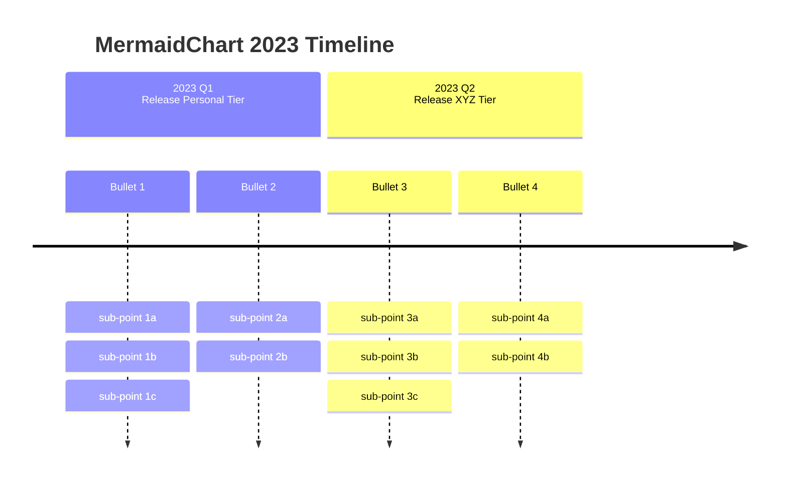

import Tabs from '@theme/Tabs';
import TabItem from '@theme/TabItem';

## Example

<Tabs groupId="preferred-lang" queryString>
<TabItem value="fsharp" label="F#">

```fsharp
siren.timeline [
    timeline.title "MermaidChart 2023 Timeline"
    timeline.section("2023 Q1 <br> Release Personal Tier", [
        timeline.multiple("Bullet 1", [
            "sub-point 1a"
            "sub-point 1b"
            "sub-point 1c"
        ])
        timeline.multiple("Bullet 2", [
            "sub-point 2a"
            "sub-point 2b"
        ])
    ])
    timeline.section("2023 Q2 <br> Release XYZ Tier", [
        timeline.multiple("Bullet 3", [
            "sub-point 3a"
            "sub-point 3b"
            "sub-point 3c"
        ])
        timeline.multiple("Bullet 4", [
            "sub-point 4a"
            "sub-point 4b"
        ])
    ])
]
|> siren.write
```

</TabItem>
<TabItem value="csharp" label="C#">

```csharp
siren.timeline
([
    timeline.title("MermaidChart 2023 Timeline"),
    timeline.section("2023 Q1 <br> Release Personal Tier",[
        timeline.multiple("Bullet 1", [
            "sub-point 1a",
            "sub-point 1b",
            "sub-point 1c"
        ]),
        timeline.multiple("Bullet 2", [
            "sub-point 2a",
            "sub-point 2b",
        ])
    ]),
    timeline.section("2023 Q2 <br> Release XYZ Tier",[
        timeline.multiple("Bullet 3", [
            "sub-point 3a",
            "sub-point 3b",
            "sub-point 3c"
        ]),
        timeline.multiple("Bullet 4", [
            "sub-point 4a",
            "sub-point 4b",
        ])
    ]),
]).write();
```

</TabItem>
<TabItem value="py" label="Python">

```py
siren.timeline([
    timeline.title("MermaidChart 2023 Timeline"),
    timeline.section("2023 Q1 <br> Release Personal Tier", [
        timeline.multiple("Bullet 1", [
            "sub-point 1a",
            "sub-point 1b",
            "sub-point 1c"
        ]),
        timeline.multiple("Bullet 2", [
            "sub-point 2a",
            "sub-point 2b",
        ])
    ]),
    timeline.section("2023 Q2 <br> Release XYZ Tier", [
        timeline.multiple("Bullet 3", [
            "sub-point 3a",
            "sub-point 3b",
            "sub-point 3c"
        ]),
        timeline.multiple("Bullet 4", [
            "sub-point 4a",
            "sub-point 4b",
        ])
    ]),
]).write()
```

</TabItem>
<TabItem value="js" label="JavaScript">

```js
siren.timeline([
    timeline.title("MermaidChart 2023 Timeline"),
    timeline.section("2023 Q1 <br> Release Personal Tier", [
        timeline.multiple("Bullet 1", [
            "sub-point 1a",
            "sub-point 1b",
            "sub-point 1c"
        ]),
        timeline.multiple("Bullet 2", [
            "sub-point 2a",
            "sub-point 2b",
        ])
    ]),
    timeline.section("2023 Q2 <br> Release XYZ Tier", [
        timeline.multiple("Bullet 3", [
            "sub-point 3a",
            "sub-point 3b",
            "sub-point 3c"
        ]),
        timeline.multiple("Bullet 4", [
            "sub-point 4a",
            "sub-point 4b",
        ])
    ]),
]).write();
```

</TabItem>
</Tabs>

{/* output */}

<Tabs>
<TabItem value="graph" label="Graph">

</TabItem>
<TabItem value="output" label="Output">
```yml
timeline
    title MermaidChart 2023 Timeline
    section 2023 Q1 <br> Release Personal Tier
        Bullet 1
            : sub-point 1a
            : sub-point 1b
            : sub-point 1c
        Bullet 2
            : sub-point 2a
            : sub-point 2b
    section 2023 Q2 <br> Release XYZ Tier
        Bullet 3
            : sub-point 3a
            : sub-point 3b
            : sub-point 3c
        Bullet 4
            : sub-point 4a
            : sub-point 4b
```
</TabItem>
</Tabs>