import Tabs from '@theme/Tabs';
import TabItem from '@theme/TabItem';

<Tabs groupId="preferred-lang" queryString>
<TabItem value="fsharp" label="F#">

```fsharp
siren.flowchart(direction.bt, [
    flowchart.subgraph ("space", [
        flowchart.directionBT
        flowchart.linkDottedArrow("earth", "moon", formatting.unicode "🚀", 6)
        flowchart.nodeRound "moon"
        flowchart.subgraph ("atmosphere", [
            flowchart.nodeCircle "earth"
        ])
    ])
])
|> siren.write
```

</TabItem>
<TabItem value="py" label="Python">

```py
import siren.siren as siren

def chart():
    return siren.siren.flowchart(siren.direction.bt(), [
        siren.flowchart.subgraph("space", [
            siren.flowchart.direction_bt(),
            siren.flowchart.link_dotted_arrow(
                "earth",
                "moon",
                siren.formatting.unicode("🚀"),
                6
            ),
            siren.flowchart.node_round("moon"),
            siren.flowchart.subgraph("atmosphere",[
                siren.flowchart.node_circle("earth")
            ])
        ])
    ])
siren.siren.write(chart())
```

</TabItem>
<TabItem value="js" label="JavsScript">

```js
import {siren, flowchart, direction, formatting } from "./siren/Siren.js"

const chart = 
  siren.flowchart(direction.bt, [
      flowchart.subgraph("space",[
          flowchart.directionBT,
          flowchart.linkDottedArrow(
            "earth", 
            "moon", 
            formatting.unicode("🚀"),
            6
          ),
          flowchart.nodeRound("moon"),
          flowchart.subgraph("atmosphere",[
            flowchart.nodeCircle("earth")
          ])
      ])
  ]);
siren.write(chart);
```

</TabItem>
</Tabs>

<Tabs>
<TabItem value="graph" label="Graph">

</TabItem>
<TabItem value="output" label="Output">

```mermaid
flowchart BT
    subgraph space
        direction BT
        earth-......->|""🚀""|moon
        moon(moon)
        subgraph atmosphere
            earth((earth))
        end
    end
```

```yml
flowchart BT
    subgraph space
        direction BT
        earth-......->|"🚀"|moon
        moon(moon)
        subgraph atmosphere
            earth((earth))
        end
    end
```
</TabItem>
</Tabs>