```mermaid
flowchart BT
    subgraph space
        direction BT
        earth-......->|""🚀""|moon
        moon(moon)
        subgraph atmosphere
            earth((earth))
        end
    end
```

import Tabs from '@theme/Tabs';
import TabItem from '@theme/TabItem';

The following classes can be useful when creating flowcharts:

- `siren`
- `flowchart`
- `direction`
- `flowchartConfig`

## With Title

<Tabs groupId="preferred-lang" queryString>
<TabItem value="fsharp" label="F#">

```fsharp
siren.flowchart(direction.lr, [
    flowchart.node("id1", "This is the text in the box")
])
|> siren.withTitle("Node with text")
|> siren.write
```

</TabItem>
<TabItem value="csharp" label="C#">

```csharp
string graph = siren.flowchart(direction.lr, [
    flowchart.node("id1", "This is the text in the box")
]).withTitle("Node with text").write();
```

</TabItem>
<TabItem value="py" label="Python">

```py
siren.flowchart(direction.lr(), [
    flowchart.node("id1", "This is the text in the box")
]).with_title("Node with text").write()
```

</TabItem>
<TabItem value="js" label="JavaScript">

```js
siren.flowchart(direction.lr, [
    flowchart.node("id1", "This is the text in the box")
]).withTitle("Node with text").write();
```

</TabItem>
</Tabs>

<Tabs>
<TabItem value="graph" label="Graph">

</TabItem>
<TabItem value="output" label="Output">
```yml
---
title: Node with text
---
flowchart LR
    id1[This is the text in the box]
```
</TabItem>
</Tabs>

## Different Lengths

<Tabs groupId="preferred-lang" queryString>
<TabItem value="fsharp" label="F#">

```fsharp
siren.flowchart(direction.td, [
    flowchart.node(a, "Start")
    flowchart.nodeRhombus(b, "Is it?")
    flowchart.node(c, "OK")
    flowchart.node(d, "Rethink")
    flowchart.node(e, "End")
    flowchart.linkArrow(a, b)
    flowchart.linkArrow(b, c, "Yes")
    flowchart.linkArrow(c, d)
    flowchart.linkArrow(d, b)
    flowchart.linkArrow(b, e, "No", 3)
]).write()
```

</TabItem>
<TabItem value="csharp" label="C#">

```csharp
(string a, string b, string c, string d, string e) = ("A", "B", "C", "D", "E");
SirenElement graph = siren.flowchart(direction.td, [
    flowchart.node(a, "Start"),
    flowchart.nodeRhombus(b, "Is it?"),
    flowchart.node(c, "OK"),
    flowchart.node(d, "Rethink"),
    flowchart.node(e, "End"),
    flowchart.linkArrow(a, b),
    flowchart.linkArrow(b, c, "Yes"),
    flowchart.linkArrow(c, d),
    flowchart.linkArrow(d, b),
    flowchart.linkArrow(b, e, "No", 3),
]);
string actual =
    graph.write();
```

</TabItem>
<TabItem value="py" label="Python">

```py
siren.flowchart(direction.td(), [
  flowchart.node("A", "Start"), 
  flowchart.node_rhombus("B", "Is it?"), 
  flowchart.node("C", "OK"), 
  flowchart.node("D", "Rethink"), 
  flowchart.node("E", "End"), 
  flowchart.link_arrow("A", "B"), 
  flowchart.link_arrow("B", "C", "Yes"), 
  flowchart.link_arrow("C", "D"), 
  flowchart.link_arrow("D", "B"), 
  flowchart.link_arrow("B", "E", "No", 3)
]).write()
```

</TabItem>
<TabItem value="js" label="JavaScript">

```js
siren.flowchart(direction.td, [
    flowchart.node("A", "Start"), 
    flowchart.nodeRhombus("B", "Is it?"), 
    flowchart.node("C", "OK"), 
    flowchart.node("D", "Rethink"), 
    flowchart.node("E", "End"), 
    flowchart.linkArrow("A", "B"), 
    flowchart.linkArrow("B", "C", "Yes"), 
    flowchart.linkArrow("C", "D"), 
    flowchart.linkArrow("D", "B"), 
    flowchart.linkArrow("B", "E", "No", 3)
]).write();
```

</TabItem>
</Tabs>

<Tabs>
<TabItem value="graph" label="Graph">

</TabItem>
<TabItem value="output" label="Output">
```yml
flowchart TD
    A[Start]
    B{Is it?}
    C[OK]
    D[Rethink]
    E[End]
    A-->B
    B-->|Yes|C
    C-->D
    D-->B
    B---->|No|E
```
</TabItem>
</Tabs>

## Subgraphs

<Tabs groupId="preferred-lang" queryString>
<TabItem value="fsharp" label="F#">

```fsharp
siren.flowchart(direction.tb, [
    flowchart.linkArrow(c1, a2)
    flowchart.subgraph("one", [
        flowchart.linkArrow(a1,a2)
    ])
    flowchart.subgraph("two", [
        flowchart.linkArrow(b1,b2)
    ])
    flowchart.subgraph("three", [
        flowchart.linkArrow(c1,c2)
    ])
]).write()
```

</TabItem>
<TabItem value="csharp" label="C#">

```csharp
(string c1, string c2, string b1, string b2, string a1, string a2) = ("c1", "c2", "b1", "b2", "a1", "a2");
SirenElement graph = siren.flowchart(direction.tb, [
    flowchart.linkArrow(c1, a2),
    flowchart.subgraph("one", [
        flowchart.linkArrow(a1,a2)
    ]),
    flowchart.subgraph("two", [
        flowchart.linkArrow(b1,b2)
    ]),
    flowchart.subgraph("three", [
        flowchart.linkArrow(c1,c2)
    ])

]);
string actual =
    graph.write();
```

</TabItem>
<TabItem value="py" label="Python">

```py
siren.flowchart(direction.tb(), [
  flowchart.link_arrow("c1", "a2"), 
  flowchart.subgraph("one", [flowchart.link_arrow("a1", "a2")]), 
  flowchart.subgraph("two", [flowchart.link_arrow("b1", "b2")]), 
  flowchart.subgraph("three", [flowchart.link_arrow("c1", "c2")])
]).write()
```

</TabItem>
<TabItem value="js" label="JavaScript">

```js
siren.flowchart(direction.tb, [
    flowchart.linkArrow("c1", "a2"), 
    flowchart.subgraph("one", [flowchart.linkArrow("a1", "a2")]), 
    flowchart.subgraph("two", [flowchart.linkArrow("b1", "b2")]), 
    flowchart.subgraph("three", [flowchart.linkArrow("c1", "c2")])
]).write();
```

</TabItem>
</Tabs>

<Tabs>
<TabItem value="graph" label="Graph">

</TabItem>
<TabItem value="output" label="Output">
```yml
flowchart TB
    c1-->a2
    subgraph one
        a1-->a2
    end
    subgraph two
        b1-->b2
    end
    subgraph three
        c1-->c2
    end
```
</TabItem>
</Tabs>

## Subgraph direction

<Tabs groupId="preferred-lang" queryString>
<TabItem value="fsharp" label="F#">

```fsharp
siren.flowchart(direction.lr, [
    flowchart.subgraph("subgraph1", [
        flowchart.directionTB
        flowchart.node(top1)
        flowchart.node(bot1)
        flowchart.linkArrow(top1, bot1)
    ])
    flowchart.subgraph("subgraph2", [
        flowchart.directionTB
        flowchart.node(top2)
        flowchart.node(bot2)
        flowchart.linkArrow(top2, bot2)
    ])
    flowchart.linkArrow(outside, "subgraph1")
    flowchart.linkArrow(outside, top2, addedLength = 2)
]).write()
```

</TabItem>
<TabItem value="csharp" label="C#">

```csharp
(string outside, string top1, string bot1, string top2, string bot2) = ("outside", "top1", "bottom1", "top2", "bottom2");
SirenElement graph = siren.flowchart(direction.lr, [
    flowchart.subgraph("subgraph1", [
        flowchart.directionTB,
        flowchart.node(top1),
        flowchart.node(bot1),
        flowchart.linkArrow(top1, bot1)
    ]),
    flowchart.subgraph("subgraph2", [
        flowchart.directionTB,
        flowchart.node(top2),
        flowchart.node(bot2),
        flowchart.linkArrow(top2, bot2)
    ]),
    flowchart.linkArrow(outside, "subgraph1"),
    flowchart.linkArrow(outside, top2, addedLength: 2),
]);
string actual = graph.write();
```

</TabItem>
<TabItem value="py" label="Python">

```py
siren.flowchart(direction.lr(), [
  flowchart.subgraph("subgraph1", [
      flowchart.direction_tb(), 
      flowchart.node("top1"), 
      flowchart.node("bottom1"), 
      flowchart.link_arrow("top1", "bottom1")
  ]), 
  flowchart.subgraph("subgraph2", [
      flowchart.direction_tb(), 
      flowchart.node("top2"), 
      flowchart.node("bottom2"), 
      flowchart.link_arrow("top2", "bottom2")
  ]), 
  flowchart.link_arrow("outside", "subgraph1"), 
  flowchart.link_arrow("outside", "top2", None, 2)
]).write()
```

</TabItem>
<TabItem value="js" label="JavaScript">

```js
siren.flowchart(direction.lr, [
    flowchart.subgraph("subgraph1", [
        flowchart.directionTB, 
        flowchart.node("top1"), 
        flowchart.node("bottom1"), 
        flowchart.linkArrow("top1", "bottom1")
    ]), 
    flowchart.subgraph("subgraph2", [
        flowchart.directionTB, 
        flowchart.node("top2"), 
        flowchart.node("bottom2"), 
        flowchart.linkArrow("top2", "bottom2")
    ]), 
    flowchart.linkArrow("outside", "subgraph1"), 
    flowchart.linkArrow("outside", "top2", null, 2)
]).write();
```

</TabItem>
</Tabs>

<Tabs>
<TabItem value="graph" label="Graph">

</TabItem>
<TabItem value="output" label="Output">
```yml
flowchart LR
    subgraph subgraph1
        direction TB
        top1[top1]
        bottom1[bottom1]
        top1-->bottom1
    end
    subgraph subgraph2
        direction TB
        top2[top2]
        bottom2[bottom2]
        top2-->bottom2
    end
    outside-->subgraph1
    outside--->top2
```
</TabItem>
</Tabs>

## Markdown strings

<Tabs groupId="preferred-lang" queryString>
<TabItem value="fsharp" label="F#">

```fsharp
siren.flowchart(direction.lr, [
    flowchart.subgraph("One", [
        flowchart.nodeRound("a", formatting.markdown(@"The **cat**
in the hat")
        )
        flowchart.nodeRhombus("b", formatting.markdown(@"The **dog** in the hog"))
        flowchart.linkArrow("a","b", formatting.markdown("Bold **edge label**"))
    ])
]).write()
```

</TabItem>
<TabItem value="csharp" label="C#">

```csharp
SirenElement graph = siren.flowchart(direction.lr, [
    flowchart.subgraph("One", [
        flowchart.nodeRound("a", formatting.markdown(@"The **cat**
in the hat")
        ),
        flowchart.nodeRhombus("b", formatting.markdown(@"The **dog** in the hog")),
        flowchart.linkArrow("a","b", formatting.markdown("Bold **edge label**"))
    ]),
]);
string actual = siren.write(graph);
```

</TabItem>
<TabItem value="py" label="Python">

```py
siren.flowchart(direction.lr(), [
    flowchart.subgraph("One", [
        flowchart.node_round("a", formatting.markdown("""The **cat**
in the hat""")), 
        flowchart.node_rhombus("b", formatting.markdown("The **dog** in the hog")), 
        flowchart.link_arrow("a", "b", formatting.markdown("Bold **edge label**"))
    ])
]).write()
```

</TabItem>
<TabItem value="js" label="JavaScript">

```js
siren.flowchart(direction.lr, [
    flowchart.subgraph("One", [
        flowchart.nodeRound("a", formatting.markdown(`The **cat**
in the hat`)), 
        flowchart.nodeRhombus("b", formatting.markdown("The **dog** in the hog")), 
        flowchart.linkArrow("a", "b", formatting.markdown("Bold **edge label**"))
    ])
]).write();
```

</TabItem>
</Tabs>

<Tabs>
<TabItem value="graph" label="Graph">

</TabItem>
<TabItem value="output" label="Output">
```yml
flowchart LR
    subgraph One
        a(""`The **cat**
in the hat`"")
        b{""`The **dog** in the hog`""}
        a-->|""`Bold **edge label**`""|b
    end
```
</TabItem>
</Tabs>

## To the Moon

<Tabs groupId="preferred-lang" queryString>
<TabItem value="fsharp" label="F#">

```fsharp
siren.flowchart(direction.bt, [
    flowchart.subgraph("space", [
        flowchart.directionBT
        flowchart.linkDottedArrow("earth", "moon", formatting.unicode("🚀"), 6)
        flowchart.nodeRound("moon")
        flowchart.subgraph("atmosphere",[
            flowchart.nodeCircle("earth")
        ])
    ])
])
|> siren.write
```

</TabItem>
<TabItem value="csharp" label="C#">

```csharp
SirenElement graph = siren.flowchart(direction.bt, [
    flowchart.subgraph("space", [
        flowchart.directionBT,
        flowchart.linkDottedArrow("earth", "moon", formatting.unicode("🚀"), 6),
        flowchart.nodeRound("moon"),
        flowchart.subgraph("atmosphere",[
            flowchart.nodeCircle("earth")
        ])
    ])
]);
string actual = siren.write(graph);
```

</TabItem>
<TabItem value="py" label="Python">

```py
siren.flowchart(direction.bt(), [
    flowchart.subgraph("space", [
        flowchart.direction_bt(), 
        flowchart.link_dotted_arrow("earth", "moon", formatting.unicode("🚀"), 6), 
        flowchart.node_round("moon"), 
        flowchart.subgraph("atmosphere", [
            flowchart.node_circle("earth")
        ])
    ])
]).write()
```

</TabItem>
<TabItem value="js" label="JavaScript">

```js
siren.flowchart(direction.bt, [
    flowchart.subgraph("space", [
        flowchart.directionBT, 
        flowchart.linkDottedArrow("earth", "moon", formatting.unicode("🚀"), 6), 
        flowchart.nodeRound("moon"), 
        flowchart.subgraph("atmosphere", [
            flowchart.nodeCircle("earth")
        ])
    ])
]).write();
```

</TabItem>
</Tabs>

<Tabs>
<TabItem value="graph" label="Graph">

</TabItem>
<TabItem value="output" label="Output">
```yml
flowchart BT
    subgraph space
        direction BT
        earth-......->|""🚀""|moon
        moon(moon)
        subgraph atmosphere
            earth((earth))
        end
    end
```
</TabItem>
</Tabs>