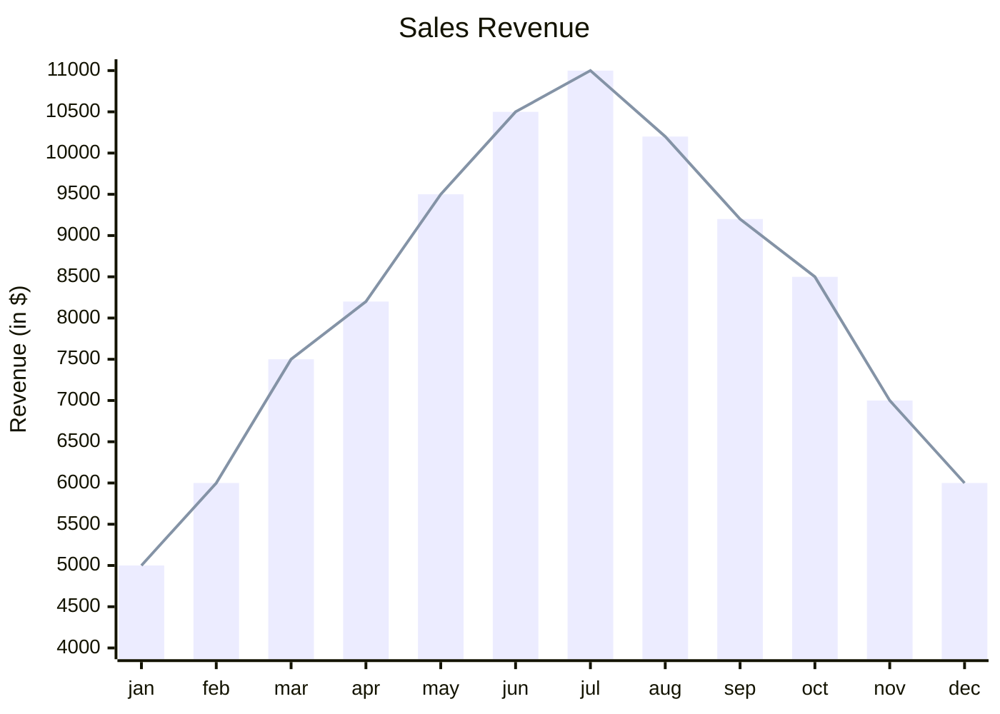

import Tabs from '@theme/Tabs';
import TabItem from '@theme/TabItem';

<Tabs groupId="preferred-lang" queryString>
<TabItem value="fsharp" label="F#">

```fsharp
siren.xyChart [
    xyChart.title "Sales Revenue"
    xyChart.xAxis ["jan"; "feb"; "mar"; "apr"; "may"; "jun"; "jul"; "aug"; "sep"; "oct"; "nov"; "dec"]
    xyChart.yAxisNamedRange ("Revenue (in $)", 4000, 11000)
    xyChart.bar [5000; 6000; 7500; 8200; 9500; 10500; 11000; 10200; 9200; 8500; 7000; 6000]
    xyChart.line [5000; 6000; 7500; 8200; 9500; 10500; 11000; 10200; 9200; 8500; 7000; 6000]
]
|> siren.write
```

</TabItem>
<TabItem value="py" label="Python">

```py
import siren.siren as siren

def chart():
    return siren.siren.flowchart(siren.direction.bt(), [
        siren.flowchart.subgraph("space", [
            siren.flowchart.direction_bt(),
            siren.flowchart.link_dotted_arrow(
                "earth",
                "moon",
                siren.formatting.unicode("🚀"),
                6
            ),
            siren.flowchart.node_round("moon"),
            siren.flowchart.subgraph("atmosphere",[
                siren.flowchart.node_circle("earth")
            ])
        ])
    ])
siren.siren.write(chart())
```

</TabItem>
<TabItem value="js" label="JavsScript">

```js
import {siren, flowchart, direction, formatting } from "./siren/Siren.js"

const chart = 
  siren.flowchart(direction.bt, [
      flowchart.subgraph("space",[
          flowchart.directionBT,
          flowchart.linkDottedArrow(
            "earth", 
            "moon", 
            formatting.unicode("🚀"),
            6
          ),
          flowchart.nodeRound("moon"),
          flowchart.subgraph("atmosphere",[
            flowchart.nodeCircle("earth")
          ])
      ])
  ]);
siren.write(chart);
```

</TabItem>
</Tabs>

<Tabs>
<TabItem value="graph" label="Graph">

</TabItem>
<TabItem value="output" label="Output">
```yml
xychart-beta
    title "Sales Revenue"
    x-axis [jan, feb, mar, apr, may, jun, jul, aug, sep, oct, nov, dec]
    y-axis "Revenue (in $)" 4000.000000 --> 11000.000000
    bar [5000, 6000, 7500, 8200, 9500, 10500, 11000, 10200, 9200, 8500, 7000, 6000]
    line [5000, 6000, 7500, 8200, 9500, 10500, 11000, 10200, 9200, 8500, 7000, 6000]
```
</TabItem>
</Tabs>