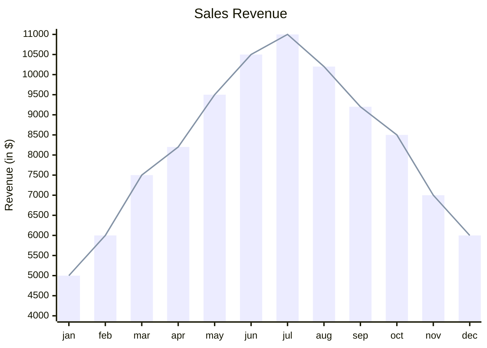

import Tabs from '@theme/Tabs';
import TabItem from '@theme/TabItem';

The following classes can be useful when creating requirement diagrams:

- `siren`
- `xyChart`
- `xyChartTheme`
- `xyChartConfig`

## Example

<Tabs groupId="preferred-lang" queryString>
<TabItem value="fsharp" label="F#">

```fsharp
siren.xyChart [
    xyChart.title "Sales Revenue"
    xyChart.xAxis ["jan"; "feb"; "mar"; "apr"; "may"; "jun"; "jul"; "aug"; "sep"; "oct"; "nov"; "dec"]
    xyChart.yAxisNamedRange ("Revenue (in $)", 4000, 11000)
    xyChart.bar [5000; 6000; 7500; 8200; 9500; 10500; 11000; 10200; 9200; 8500; 7000; 6000]
    xyChart.line [5000; 6000; 7500; 8200; 9500; 10500; 11000; 10200; 9200; 8500; 7000; 6000]
]
|> siren.write
```

</TabItem>
<TabItem value="csharp" label="C#">

```csharp
siren.xyChart([
    xyChart.title("Sales Revenue"),
    xyChart.xAxis(["jan", "feb", "mar", "apr", "may", "jun", "jul", "aug", "sep", "oct", "nov", "dec"]),
    xyChart.yAxisNamedRange("Revenue (in $)", 4000, 11000),
    xyChart.bar([5000, 6000, 7500, 8200, 9500, 10500, 11000, 10200, 9200, 8500, 7000, 6000]),
    xyChart.line([5000, 6000, 7500, 8200, 9500, 10500, 11000, 10200, 9200, 8500, 7000, 6000])
]).write();
```

</TabItem>
<TabItem value="py" label="Python">

```py
siren.xy_chart([
    xy_chart.title("Sales Revenue"),
    xy_chart.x_axis(["jan", "feb", "mar", "apr", "may", "jun", "jul", "aug", "sep", "oct", "nov", "dec"]),
    xy_chart.y_axis_named_range("Revenue (in $)", 4000, 11000),
    xy_chart.bar([5000, 6000, 7500, 8200, 9500, 10500, 11000, 10200, 9200, 8500, 7000, 6000]),
    xy_chart.line([5000, 6000, 7500, 8200, 9500, 10500, 11000, 10200, 9200, 8500, 7000, 6000])
]).write()
```

</TabItem>
<TabItem value="js" label="JavaScript">

```js
siren.xyChart([
    xyChart.title("Sales Revenue"),
    xyChart.xAxis(["jan", "feb", "mar", "apr", "may", "jun", "jul", "aug", "sep", "oct", "nov", "dec"]),
    xyChart.yAxisNamedRange("Revenue (in $)", 4000, 11000),
    xyChart.bar([5000, 6000, 7500, 8200, 9500, 10500, 11000, 10200, 9200, 8500, 7000, 6000]),
    xyChart.line([5000, 6000, 7500, 8200, 9500, 10500, 11000, 10200, 9200, 8500, 7000, 6000])
]).write();
```

</TabItem>
</Tabs>

{/* output */}

<Tabs>
<TabItem value="graph" label="Graph">

</TabItem>
<TabItem value="output" label="Output">
```yml
xychart-beta
    title "Sales Revenue"
    x-axis [jan, feb, mar, apr, may, jun, jul, aug, sep, oct, nov, dec]
    y-axis "Revenue (in $)" 4000.000000 --> 11000.000000
    bar [5000, 6000, 7500, 8200, 9500, 10500, 11000, 10200, 9200, 8500, 7000, 6000]
    line [5000, 6000, 7500, 8200, 9500, 10500, 11000, 10200, 9200, 8500, 7000, 6000]
```
</TabItem>
</Tabs>