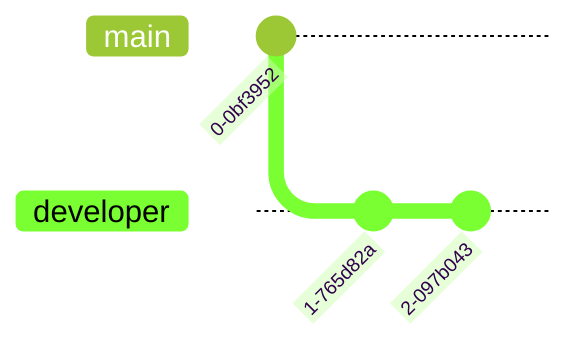

import Tabs from '@theme/Tabs';
import TabItem from '@theme/TabItem';


# Themes

Mermaid supports an array of different base themes. 

<Tabs>
<TabItem value="graph" label="Graph">

</TabItem>
<TabItem value="output" label="Output">
```yml
---
config:
    theme: forest
---
gitGraph
    commit
    branch developer
    commit
    commit
```
</TabItem>
</Tabs>

Siren makes setting a theme easy!

<Tabs groupId="preferred-lang" queryString>
<TabItem value="fsharp" label="F#">

```fsharp
siren.git [
    git.commit()
    git.branch "developer"
    git.commit()
    git.commit()
]
|> siren.withTheme (theme.forest)
|> siren.write
```

</TabItem>
<TabItem value="csharp" label="C#">

```csharp
siren.git
([
    git.commit(),
    git.branch("developer"),
    git.commit(),
    git.commit(),
])
    .withTheme(theme.forest)
    .write();
```

</TabItem>
<TabItem value="py" label="Python">

```py
siren.git([
    git.commit(),
    git.branch("developer"),
    git.commit(),
    git.commit(),
])
    .with_theme(theme.forest())
    .write()
```

</TabItem>
<TabItem value="js" label="JavaScript">

```js
siren.git([
    git.commit(),
    git.branch("developer"),
    git.commit(),
    git.commit(),
])
    .withTheme(theme.forest)
    .write();
```

</TabItem>
</Tabs>

