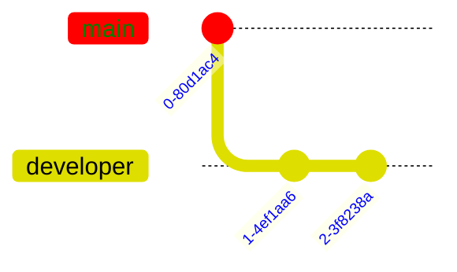

import Tabs from '@theme/Tabs';
import TabItem from '@theme/TabItem';

# Theme Variables

Theme Variables are not supported for all graphs, these may offer a style(s) line which allows fine tuning styling. 
For the graphs supporting theme variables, you can use Siren to write them into the YAML frontmatter.

```yaml
---
config:
    themeVariables:
        git0: red
        commitLabelColor: blue
        gitBranchLabel0: green
---
gitGraph
    commit
    branch developer
    commit
    commit
```



# Usage

<Tabs groupId="preferred-lang" queryString>
<TabItem value="fsharp" label="F#">

```fsharp
siren.git [
  git.commit()
  git.branch "developer"
  git.commit()
  git.commit()
]
|> siren.addThemeVariable(gitTheme.git0 "red")
|> siren.addThemeVariable(gitTheme.commitLabelColor "blue")
|> siren.addThemeVariable(gitTheme.gitBranchLabel0 "green")
|> siren.write
```

</TabItem>
<TabItem value="csharp" label="C#">

```csharp
siren.git
([
    git.commit(),
    git.branch("developer"),
    git.commit(),
    git.commit(),
])
    .addThemeVariable(gitTheme.git0("red"))
    .addThemeVariable(gitTheme.commitLabelColor("blue"))
    .addThemeVariable(gitTheme.gitBranchLabel0("green"))
    .write();
```

</TabItem>
<TabItem value="py" label="Python">

```py
siren.git([
    git.commit(),
    git.branch("developer"),
    git.commit(),
    git.commit(),
])
    .add_theme_variable(git_theme.git0("red"))
    .add_theme_variable(git_theme.commit_label_color("blue"))
    .add_theme_variable(git_theme.git_branch_label0("green"))
    .write()
```

</TabItem>
<TabItem value="js" label="JavaScript">

```js
siren.git([
    git.commit(),
    git.branch("developer"),
    git.commit(),
    git.commit(),
])
    .addThemeVariable(gitTheme.git0("red"))
    .addThemeVariable(gitTheme.commitLabelColor("blue"))
    .addThemeVariable(gitTheme.gitBranchLabel0("green"))
    .write();
```

</TabItem>
</Tabs>

In case you cannot find a specifc config option you are looking for, you can always use:

```csharp
themeVariable.custom(configName, configValue)
```

Here an example in C# using `themeVariable.custom`.

```csharp
siren.git([
    git.commit(),
    git.branch("developer"),
    git.commit(),
    git.commit(),
])
    .addThemeVariable(themeVariable.custom("git0", "red"))
    .addThemeVariable(themeVariable.custom("commitLabelColor", "blue"))
    .addThemeVariable(themeVariable.custom("gitBranchLabel0", "green"))
    .write();
```